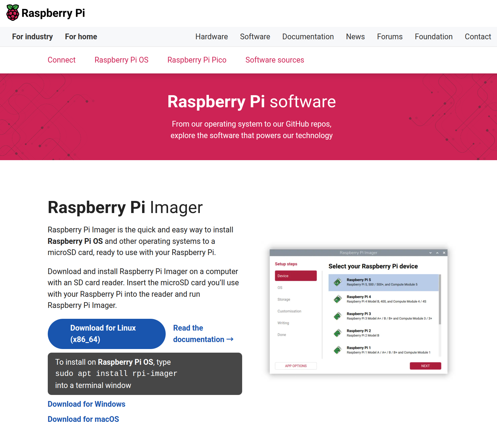
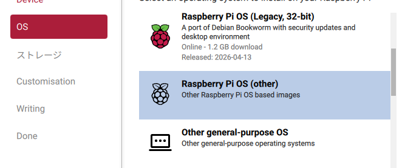
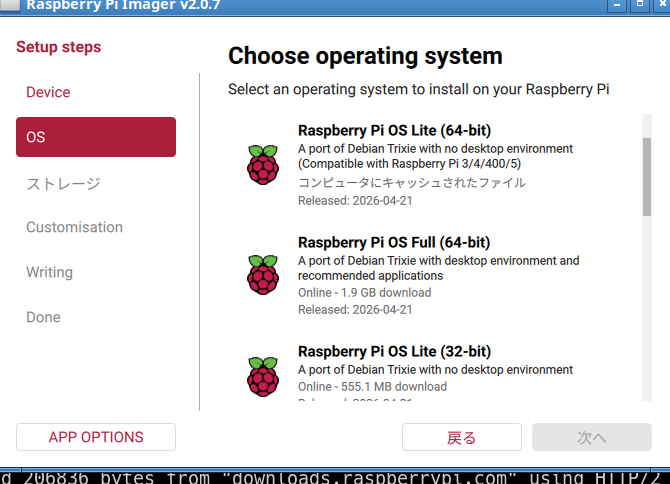

+++
title = "インストール"
description = ""
date ="2026-05-06"
+++

aptでもインストールできるが、だいぶ古いので、[公式](https://www.raspberrypi.com/software/)から入手。



自分のPCはLubuntu 26.04なので。Linux版を入手。以下で起動。

```bash
chmod +x imager_2.0.7_amd64.AppImage
sudo ./imager_2.0.7_amd64.AppImage
```

あとは順番に設定してSDカードに書き込むだけ。GUIが不要なら、OSのところで、Paspberry Pi OS (other)を選んで、



Raspberry Pi OS Liteを選ぶと良い。RAMが2GB以下なら、32bit版の方がメモリー効率が良いと思う。



ラズパイにSDを差して電源を入れる。緑のアクセスランプが落ち着くまで待つ(数分)。

自分のPCにavahi-utilsが入っていなければ入れておくと良い。

```bash
sudo apt install avahi-utils
```

avahi-browseを起動して、SDを焼く時に指定したhostnameでgrepすると、以下のように出てくる(つづり間違えてたw)。

```bash
avahi-browse -a | grep rapsberry
+ enp1s0 IPv6 rapsberry4 [dc:a6:32:91:41:08]                Workstation          local
+ enp1s0 IPv4 rapsberry4 [dc:a6:32:91:41:08]                Workstation          local
```

SDを焼く時にSSHを構成していれば、以下で入れる(userは、SD焼く時に指定したユーザー名、rapsberry4部分が、上で見つかったホスト名)。

```bash
ssh user@rapsberry4.local
```

外部公開しないなら、password認証で良いが、そうでないなら鍵認証なりtailscale sshなりを使うのが良い。JavaScript開発をやるなら、ホームディレクトリ内のファイルは全て盗難される危険があると考えた方が良いので、鍵認証ならyubikeyとかにした方が良いだろう。
