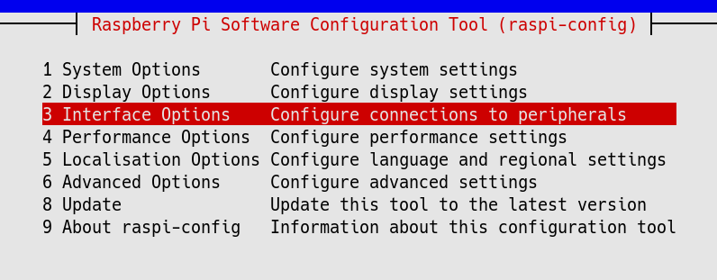
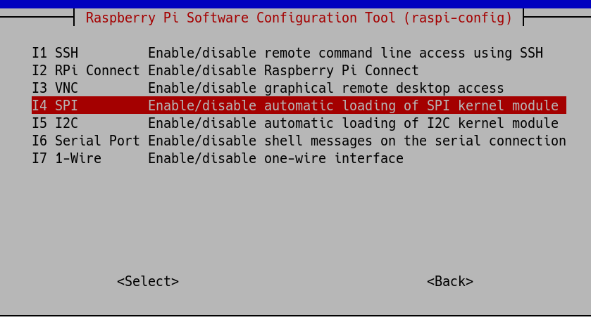
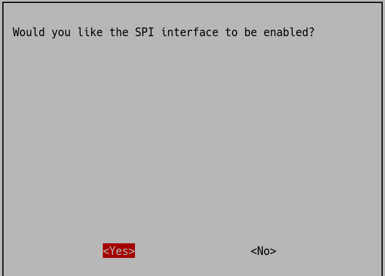
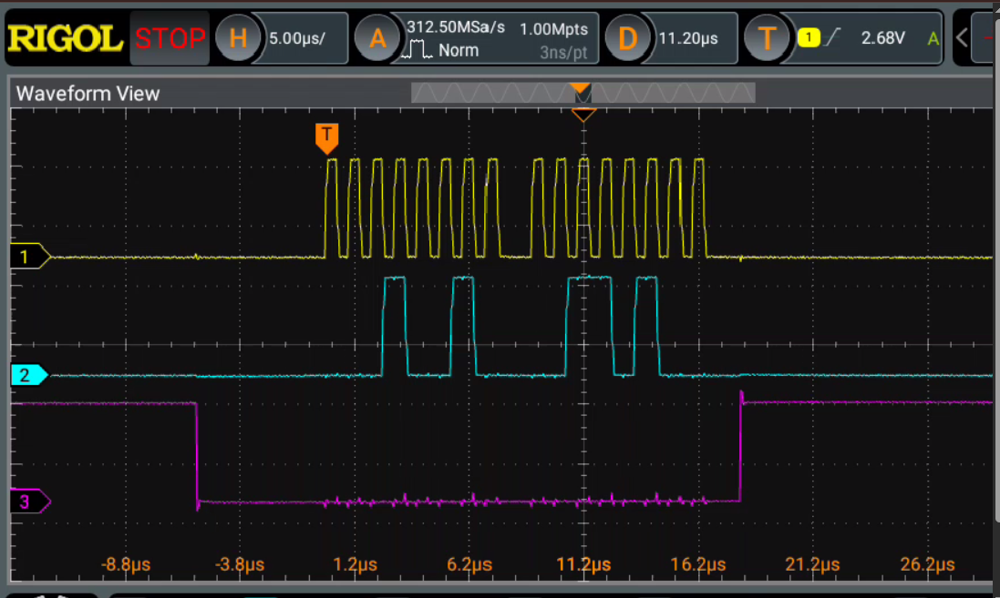

+++
title = "SPI制御"
description = ""
date="2026-05-06"
+++

SPIの制御。今回はラズパイ4を使用。もっと古いのでも大丈夫だと思う。インストールはこちら。

[インストール](/diy/raspberrypi/install)

結線は[こちら](https://www.raspberrypi.com/documentation/computers/raspberry-pi.html#gpio)

まずSPIが使えるように構成する。

```bash
sudo raspi-config
```

Interface Optionsを選んで、

SPIを選んで、

enableする。

デバイスが認識されていることを確認。

```bash
ls /dev/spi*
/dev/spidev0.0  /dev/spidev0.1
```

簡単に動作確認するならspi-toolsが良い。

```bash
sudo apt-get update
sudo apt-get install spi-tools
```

```bash
echo -ne "\x12\x34" | spi-pipe -b 2 -d /dev/spidev0.0 -s 1000000 | od -t x1
0000000 00 00
0000002
```

* echo -ne: 改行コードを送信しない。エスケープシーケンスを有効化(\xhhで16進数を指定できるようになる)

* "\x12\x34": 送信データ

* -d: デバイス指定

* -s: スピード（1MHz）

* -b: ブロックサイズ(ブロックサイズを指定しないと1バイトごとの送信になるので、1バイト送るごとにCSが戻る)

* od -t x1: 受信したバイナリを1バイトずつの16進数で表示

SPIでは送信したデータと同じ長さのデータを受信する。今回はMISOには何もつないでいないので、2バイトの0が受信されて表示されている。

オシロで見るとこんな感じ。上からclock, MOSI, CS。