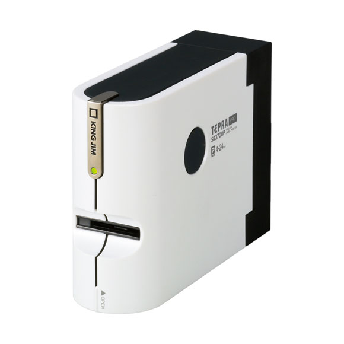
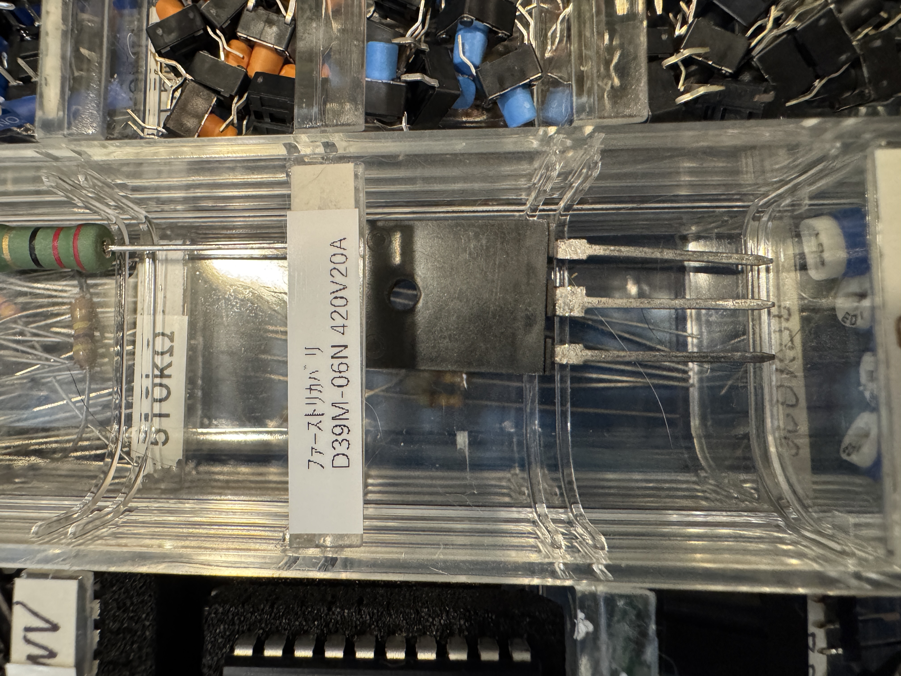
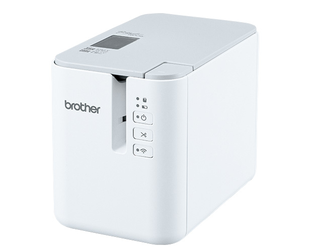
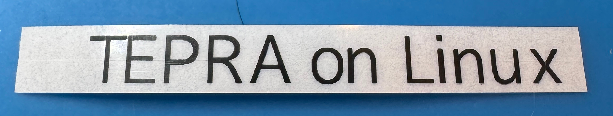
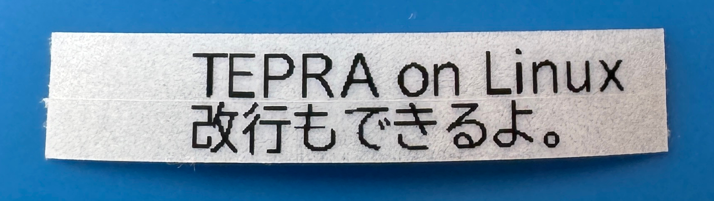
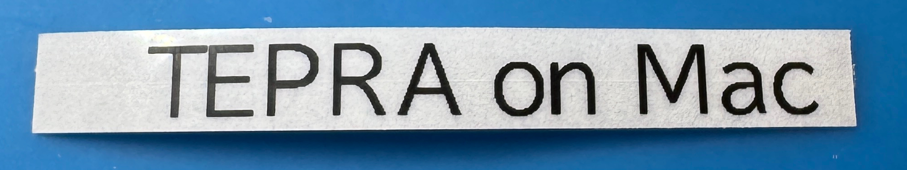

+++
date ="2026-7-20"
title = "大昔のTEPRAをLinux対応してみた話"
[taxonomies]
tags = ["DIY"]
[extra]
og_image = "/diy/tepra-linux/ogp.jpg"
+++

# テプラを買い替えた話

大昔に買った[「テプラ」PRO SR3700P](https://www.kingjim.co.jp/products/tepra/sr3700p.html)



ハードウェアとしては故障知らず。最新のMacOSで付属アプリが動かなくなってしまったが、それでもWindowsなら動くのでだましだまし使っていた。付属のアプリは自由度が高く、凝ったラベルを作るには良いのだが、自分の場合は下の写真のような部品のラベルを作ることがほとんどなので逆にオーバースペックで操作が面倒な感じがあった。



しかもハーフカット機能が無いのが地味に辛く、結局昨年[ブラザー PT-P900W](https://www.brother.co.jp/product/labelprinter/ptp900w/index.aspx)がメルカリで1万強で出ていたので購入、それ以来はもっぱらこちらを使用していた。



こいつはWi-Fiとスマホ対応なので、ラベルが作りたくなったらスマホでさくっと印刷できる。スマホアプリも最低限の機能しかないので簡単だ。なぜブラザーにしたのかと言うと、テプラの古いテープはテプラ最新機種では使えないようだったので、テプラにしたところで手持ちのテープがゴミになることと、ブラザーは印刷命令を公開しているので、将来、スマホアプリがサポート終了になったとしても、いざとなったら自分でアプリを書けるかなと思ったからだ。

さて、テプラの方はテープが色々残っていたので捨てるに捨てられず、とはいえ結局Windowsを引っぱり出してきてケーブルをつないで、Windowsの起動を待って、あのアプリでちくちくとラベルをデザインというのは、あまりに億劫であり結局全く使わず終い。やはり捨てるしかないかと思っていたところ、ドライバーをAIで移植したという話を見かけた。

<blockquote class="twitter-tweet"><p lang="ja" dir="ltr">フットペダルを買ったんだけど、「Windowsじゃないとドライバーをインストールしてセットアップできない」仕様だったので、codex workに.exeのドライバーファイルを渡して「macで使えるようにできる？」と聞いたら、10分後に使えるようになってたんだけどAI怖い <a href="https://t.co/TUEs5DLWO4">pic.twitter.com/TUEs5DLWO4</a></p>&mdash; ミロ (@ml0_1337) <a href="https://x.com/ml0_1337/status/2077910000966701521?ref_src=twsrc%5Etfw">July 17, 2026</a></blockquote> <script async src="https://platform.x.com/widgets.js" charset="utf-8"></script>

それならテプラもLinuxで動くようにできるかなと思いトライしてみることにした。今回は基本はopencode + Claude Sonnet 5を使った。

# まずはWine

テプラをLinuxに接続すると、ちゃんとcupsで認識される。AIに相談してみると、それならWineでいけるかもとのこと。最初はテプラアプリのインストーラーの漢字が出ないようなひどい状況だったが、AIのアドバイスに従って進めることで最後のデバイス認識の手前までは動くようになった。ただこの最後のデバイス認識がうまくいかず結局あきらめ。

# Wireshark + USBPcap

次にAIに提案されたのは、USBをキャプチャしてリバースエンジニアリングするという方法。まぁそうなるか。

[USBPcap](https://desowin.org/usbpcap/tour.html)というのがあり、これをWiresharkを組み合わせるとUSBの通信をキャプチャできるのだそうだ。しかしいくらやってみてもWiresharkのキャプチャデバイスにUSBが出てこない。AIは「きっとUSB3.0との相性が悪いので、USB2.0のハブ経由でつないでください」とか、本当かよ？ という提案をしてきて早くも泥沼感。

# プリンター設定でポートをFILE:にしたらいいのでは？

ふと、

「Windowsからはプリンターとして認識されているから、ポートの設定をFILE:にしたらファイルに出力できない？」

と聞いてみると「素晴しい提案です」と。なんかAIって視野が狭いというか何かに熱中すると、少し離れて別の方策を考えるのが苦手だよね。そのうち改善されるのかな。

で「"A"を印字したデータを下さい」、「"AA"もお願い」と次々と要求されて取得したのが[これ](https://github.com/ruimo/tpsr3700/tree/main/tests/fixtures)。しばらく考え込んだ後「構造が分かりました」と。このあたりは確かにAI凄いよね。

# Rustで実装

言語はRustを指定。なかなか動かずしばらく悩んでいたが10分ほど経ったところで、突如Linux側につないだテプラからテープが印字された。使用されていたライブラリはこんな感じだった。

```toml
[dependencies]
fontdue = "0.9"
rusb = "0.9"
clap = { version = "4", features = ["derive"] }
anyhow = "1"
```

キャプチャデータの入手からここまで30分くらいでできたので、この手の仕事の生産性は驚異的だ。自分がやったら数日はかかるだろう。

# そしてグダグダに

つい嬉しくなって、色々と機能の追加を頼む。これが良くない。そして「なんとなく動くけど、細部の動きは怪しい」ものになってしまう。何度も経験しているのにまたやってしまったなと反省しつつ、テストを書いてもらう。フォントレンダリングが要なので、[フォントレンダリングのコード](https://github.com/ruimo/tpsr3700/blob/main/src/font/mod.rs)は、テストで印字内容をASCII artで比較するようにした(コードの最下部)。幸いAIはこのASCII artも理解してくれるので「Dの上が欠けているの分かるよね？ 直してね」と指示できるから楽だ。テストを介することにより細かな動きは改善された。やはりテスト大事。

あと、雑に要望を伝えても全然思った通りにならないので、自分で1つ1つロジックを考えてみると当初考えていたより描画のロジックが複雑だった。特に行の折り返しの処理。最初は仕様を書いて伝えてみたが、それより実例を示す方がAIも理解が進む感じだったので、こんな風に指示した。


- 最初に入力文字列内の\nを調べて行数を調べます。\nが無ければ1行です。
- "ABCDEFGHIJKLM\nN"を6mmテープに印字するとしましょう。行数は2です。
- まず"ABCDEFGHIJKLM"をフォントメトリクスに従い1行描画します。行数の2とテープ幅からフォントサイズを決めます
- しかしテープ長さが指定されており、"ABCDEFGHIJKL"までしか描画できないことが分かったとします。
- "M"は次の行に送ります。["ABCDEFGHIJKL", "MN"]
- "ABCDEFGHIJKL"をフォントメトリクスに従い1行描画します。これは当然正しく描画可能です
- 縦方向のインクの広がりを見ます。仮に15dotだったとします。
- 6mmで2行なら1行高さは20dotなので、フォントサイズを20/15倍にして"ABCDEFGHIJKL"を描画しなおします。
- すると"ABCDEFGHIJ"までしか収まらなかったとします。
- "KL"を押し出します["ABCDEFGHIJ", "KLMN"]。
- これで1行目確定です。
- 同様に2行目の"KLMN"の描画を実施します。
- この時に"KLMN"もテープ長さ範囲に入り切らなければあふれた部分は3行目に押し出します。この時6mmテープであれば最大2行しかないので溢れた部分は捨てますが、9mmテープなら3行印字可能なため、新たに最初のステップに戻り3行印字としてやり直します。    

このロジックをテストできるように1つの関数にまとめて実装してください。


このあたり、自分も仕様書を読むより実例やサンプルを示してもらった方が話が速いのでAIも同じってところか。

# テープ幅の検出をしたい

テプラでは装着しているテープの幅を自動検出できる。しかし、これは先ほどのプリンターのポートをFILE:にしてもキャプチャできない。どうも印字内容しか記録されないようだ。AIに相談すると、[RedMon](https://www.ghostgum.com.au/software/redmon.htm)というのがあるよと。これをインストールすると、プリンターのポートとして使えて、そこで好きなプログラムを起動できるようだ。ただいかんせん古過ぎるようで、Windows 11ではまともに動かなかった。

もう一度Wiresharkを試すことにする。ただしWiresharkを起動しても無理だったので方法を変える。USBPcapをインストールするとUSBPcapCMD.exeというプログラムがインストールされる。そこでこれを管理者権限で起動すると、USBに接続されている機器が一覧された。そこにTEPRAもあったのでキャプチャしたいデバイスに指定して、テープ幅検出のボタンを押したところ、見事[pcapファイル](https://github.com/ruimo/tpsr3700/tree/main/captures)が生成された。

あとはAIにこれを渡してやったら、テープ幅の検出も可能になった。

# フォントを指定

今の実装を見たら、フォントにはたまたま私のPCに入っていたnotoフォントが絶対パス指定されていてイマイチだったので、[BIZ UDPゴシック](https://fonts.google.com/specimen/BIZ+UDPGothic)をアプリ内に埋め込んで使うことにした。[ライセンス](https://fonts.google.com/specimen/BIZ+UDPGothic/license)に以下のように書かれているので大丈夫そう。組み込み機器なんかでも使えそうだ。良い時代になりましたな。


Original or Modified Versions of the Font Software may be bundled, redistributed and/or sold with any software, provided that each copy contains the above copyright notice and this license. These can be included either as stand-alone text files, human-readable headers or in the appropriate machine-readable metadata fields within text or binary files as long as those fields can be easily viewed by the user.


<br>

# GitHub actionsでビルド

AIにGitHub actionsを構成してもらって[バイナリ](https://github.com/ruimo/tpsr3700/releases)をビルドしたので、CLIで利用可能だ。


$ tpsr3700 "TEPRA on Linux"




CLIで一発なので簡単。もうスマホすら不要だ。


$ tpsr3700 "TEPRA on Linux\n改行もできるよ。"




複数行印字もOK。

# Macでも動いてしまった

Macでも動きそうか聞いてみたところ「cupsに掴まれるのを防ぐコードは、Macでは不要なので、そこを条件コンパイルにすれば良いです」とのこと。半信半疑で試したら動いてしまった...


$ tpsr3700 "TEPRA on Mac"




# あとがき

あとは[README](https://github.com/ruimo/tpsr3700)もAIに書いてもらい、2日ほどで動くようになってしまった。確かに生産性の向上は絶大だ。一方でAIだけで何でもできるってわけではなく、要所要所で人間がアドバイスしたり方向性を決めたりしてやらないと「なんとなく動く怪しいもの」になってしまうので、今のところは人の仕事が無くなるってのは大袈裟だろうと思う。
