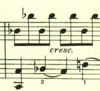
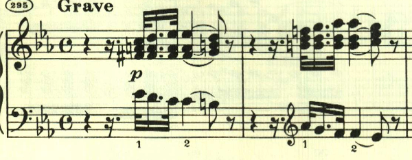
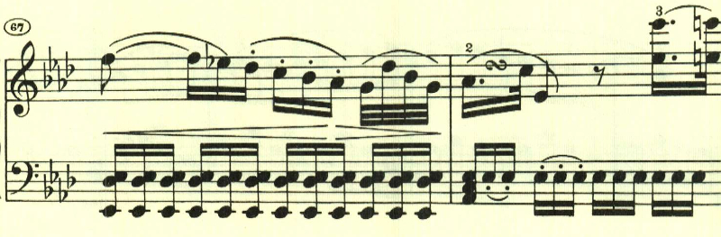
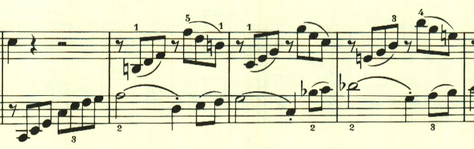

+++
title = "ベートーヴェン ピアノソナタ 第8番「悲愴」"
+++

## 第1楽章

<iframe height="175" width="100%" title="Media player" src="https://embed.music.apple.com/us/album/piano-sonata-no-8-in-c-minor-op-13-pathetique-i-grave/937943891?i=937943917&amp;itscg=30200&amp;itsct=music_box_player&amp;ls=1&amp;app=music&amp;mttnsubad=937943917&amp;theme=auto" id="embedPlayer" style="border:0;border-radius:12px;width:100%;height:175px;max-width:660px" sandbox="allow-forms allow-popups allow-same-origin allow-scripts allow-top-navigation-by-user-activation" allow="autoplay *; encrypted-media *; clipboard-write"></iframe>

有名な悲愴ソナタ。7番で4楽章制に回帰していたが、8番では3楽章制に戻っている。曲はGraveの序奏で始まる。この序奏は単なる序奏に留まらず曲全体で使われる。

序奏内でもテーマの展開は始まっている。長調の出だしと激しい短調の組み合わせは、葛藤を思わせる。

序奏が終わり、左手のトレモロの上に、最初のテーマが現れる。ここはpで音量を抑えていることが絶大な効果を上げている。

2つ目のテーマも、前半後半に分かれており、やはり何か葛藤を思わせる。

繰り返しの後、展開部に入る前に序奏が再度現れる。

展開部が始まり最初のテーマが展開される。

左手で不気味な音型が繰り返される。

ここでは最初の主題の後半部分が展開される。

再現部を経て、最後にもう一度序奏が現れた後に、最初のテーマが奏されて劇的に終わる。

## 第2楽章

<iframe height="175" width="100%" title="Media player" src="https://embed.music.apple.com/us/album/piano-sonata-no-8-in-c-minor-op-13-pathetique-ii-adagio/937943891?i=937943918&amp;itscg=30200&amp;itsct=music_box_player&amp;ls=1&amp;app=music&amp;mttnsubad=937943918&amp;theme=auto" id="embedPlayer" style="border:0;border-radius:12px;width:100%;height:175px;max-width:660px" sandbox="allow-forms allow-popups allow-same-origin allow-scripts allow-top-navigation-by-user-activation" allow="autoplay *; encrypted-media *; clipboard-write"></iframe>

第2楽章は、暖かな春の日差しを思わせるような優しい旋律を持ちいたロンド。ロンド形式は、これまでは速い楽章で用いられることが多かったので、これも新たな試みの1つなのだろう。

短調となるが、深刻な感じとはならずに引き続きのどかな雰囲気が続く。

最初のテーマが伴奏に少しアレンジが入って繰り返される。

再度短調となる。ここは次第に激しさを増していくが、深刻な感じはなく、通り雨が通り過ぎていったかのよう。

再度、最初のテーマ。やはり伴奏にアレンジが入っている。

経過句のような短かなパッセージが入って靜かに終わる。

## 第3楽章

<iframe height="175" width="100%" title="Media player" src="https://embed.music.apple.com/us/album/piano-sonata-no-8-in-c-minor-op-13-pathetique-iii-rondo/937943891?i=937943919&amp;itscg=30200&amp;itsct=music_box_player&amp;ls=1&amp;app=music&amp;mttnsubad=937943919&amp;theme=auto" id="embedPlayer" style="border:0;border-radius:12px;width:100%;height:175px;max-width:660px" sandbox="allow-forms allow-popups allow-same-origin allow-scripts allow-top-navigation-by-user-activation" allow="autoplay *; encrypted-media *; clipboard-write"></iframe>

第3楽章はロンド。初期の頃に何度も試みられていた様々なテーマを出現させる構成が結実している。この曲はまた緩急を効果的に使うことに成功している。

曲は何かに追い立てられるような旋律で始まる。

スケール主体の最初の主題と異なり、アルペジオ主体の主題。

再びスケール主体のものが現れる。

対照的なゆったりとした和音で構成される長調となる。

そしてスケール主体な印象的なクライマックス。

ここも対照的なゆったりとした雰囲気となる。

ここは、最初のテーマの一部が展開される。

最後に、曲の終わりを感じさせるテーマが2つ現れて展開される

最後の最後にゆっくりとしたテーマが現れる印象的に終わる。

楽譜引用はヘンレ版

