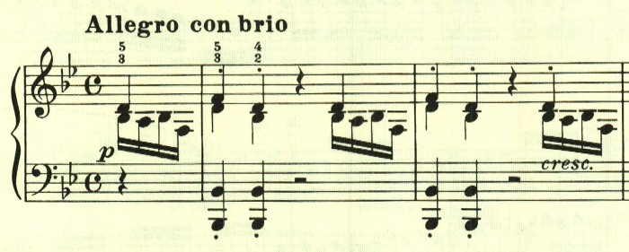
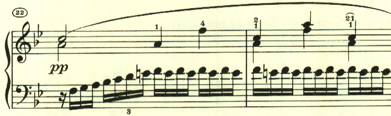
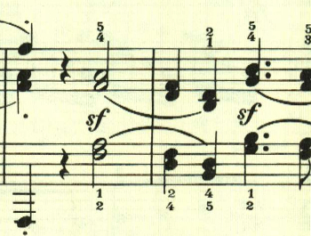
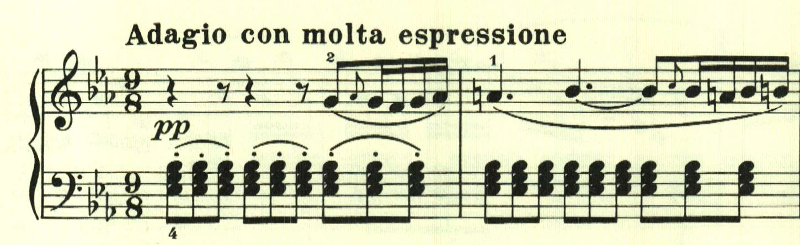
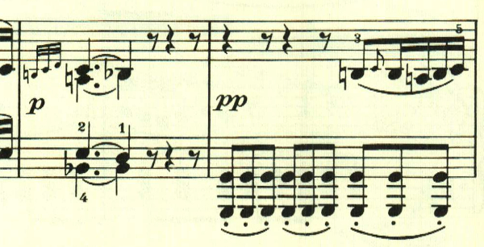
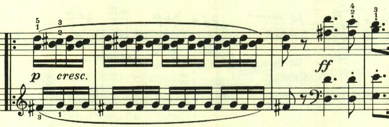

+++
title = "ベートーヴェン ピアノソナタ第11番"
+++

## 第1楽章

<iframe height="175" width="100%" title="Media player" src="https://embed.music.apple.com/us/album/piano-sonata-no-11-in-b-flat-major-op-22-i-allegro-con-brio/1268209323?i=1268209514&amp;itscg=30200&amp;itsct=music_box_player&amp;ls=1&amp;app=music&amp;mttnsubad=1268209514&amp;theme=auto" id="embedPlayer" style="border:0;border-radius:12px;width:100%;height:175px;max-width:660px" sandbox="allow-forms allow-popups allow-same-origin allow-scripts allow-top-navigation-by-user-activation" allow="autoplay *; encrypted-media *; clipboard-write"></iframe>

第11番は、元気の良い主題で始まる。

この曲も様々なテーマが次々と登場し、初期ソナタの代表作と言える。

どのテーマも明るい光に溢れている。

ここで少し落ち着く。

スケール主体の力いっぱいのテーマ。

展開部は最初のテーマで始まる。

展開部では、このテーマが繰り返し用いられる。

最初のテーマが再現されて終わる。

## 第2楽章

<iframe height="175" width="100%" title="Media player" src="https://embed.music.apple.com/us/album/piano-sonata-no-11-in-b-flat-major-op-22-ii-adagio/1268209323?i=1268209515&amp;itscg=30200&amp;itsct=music_box_player&amp;ls=1&amp;app=music&amp;mttnsubad=1268209515&amp;theme=auto" id="embedPlayer" style="border:0;border-radius:12px;width:100%;height:175px;max-width:660px" sandbox="allow-forms allow-popups allow-same-origin allow-scripts allow-top-navigation-by-user-activation" allow="autoplay *; encrypted-media *; clipboard-write"></iframe>

第1楽章が長調なら、多くのケースで第2楽章は短調となるところだが、第11番では、第2楽章は引き続き長調で、のどかな雰囲気となっている。また第2楽章としては珍しくソナタ形式となっている。

青空を見上げるような爽やかなテーマが続く。

そして、そよ風のようなテーマで終始明い雰囲気が続く。

展開部は短調で開始し、最初のテーマが展開されていく。

再現部。

最後までのどかな雰囲気が続いて終わる。

## 第3楽章

<iframe height="175" width="100%" title="Media player" src="https://embed.music.apple.com/us/album/piano-sonata-no-11-in-b-flat-major-op-22-iii-menuetto/1268209323?i=1268209516&amp;itscg=30200&amp;itsct=music_box_player&amp;ls=1&amp;app=music&amp;mttnsubad=1268209516&amp;theme=auto" id="embedPlayer" style="border:0;border-radius:12px;width:100%;height:175px;max-width:660px" sandbox="allow-forms allow-popups allow-same-origin allow-scripts allow-top-navigation-by-user-activation" allow="autoplay *; encrypted-media *; clipboard-write"></iframe>

第1, 2楽章に続いて、第3楽章も長調が続く。11番は古典的な4楽章のソナタで3楽章にはメヌエットが配置されている。

最初のテーマが繰り返された後は、二重音を使用したテーマが現れる。

中間部は、高速なスケールを主体とした短調で対比が見事。

## 第4楽章

<iframe height="175" width="100%" title="Media player" src="https://embed.music.apple.com/us/album/piano-sonata-no-11-in-b-flat-major-op-22-iv-rondo-allegretto/1268209323?i=1268209517&amp;itscg=30200&amp;itsct=music_box_player&amp;ls=1&amp;app=music&amp;mttnsubad=1268209517&amp;theme=auto" id="embedPlayer" sandbox="allow-forms allow-popups allow-same-origin allow-scripts allow-top-navigation-by-user-activation" allow="autoplay *; encrypted-media *; clipboard-write" style="border: 0px; border-radius: 12px; width: 100%; height: 175px; max-width: 660px;"></iframe>

ソナタ第11番は、第4楽章まで全て長調。曲は即興的なテーマで始まる。

2つ目のテーマも長調。

展開部は2つ目のテーマが短調で展開される。

もこもとしたテーマが続く。

再現部は最初のテーマが左手に表れる。

ここは三連符による変化。

最後まで明い雰囲気で終わる。

楽譜引用はヘンレ版。
