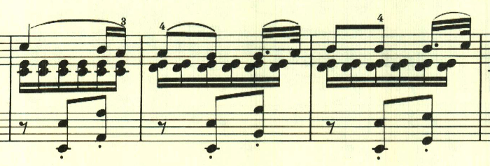
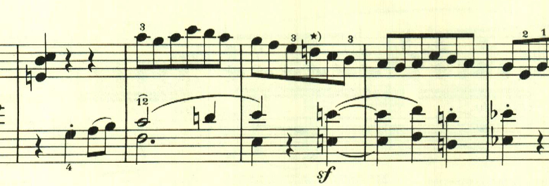
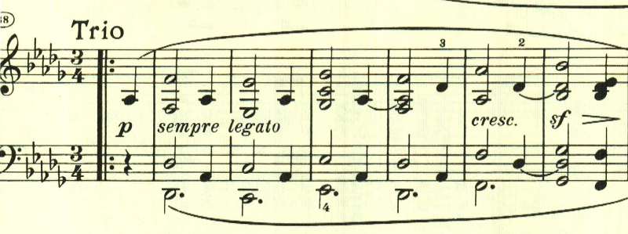
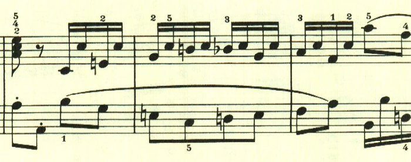

+++
title = "ベートーヴェン ピアノソナタ第12番"
+++

## 第1楽章

<iframe allow="autoplay *; encrypted-media *;" sandbox="allow-forms allow-popups allow-same-origin allow-scripts allow-top-navigation-by-user-activation" style="padding:0;width:660px;height:150px;max-width:100%;border:none;overflow:hidden;background:transparent;" src="https://embed.music.apple.com/us/album/piano-sonata-no-12-in-flat-major-op-26-i-andante-con/1272663034?i=1272663038"></iframe>

ソナタ第12番も、11番に引き続き4楽章構成だが、これまでと異なり、変奏曲、スケルツォ、葬送行進曲、ロンドという新しい構成が試みられている。
第1楽章は、暖かな日射しと快い風を思わせるような、明いテーマで始まる。

第1変奏は、アルペジオ主体。

第2変奏は、右と左とで互いに奏しながら、左手でテーマを奏する。

第3変奏は、短調となるが、やはり右と左とで、ずれて奏される。

第4変奏は、テーマの3音を2音に減らす変化が加えられる。

第5変奏は、3連符で流れるような変奏。

最後に、終わりを告げるテーマが表れて静かに終わる。

## 第2楽章

<iframe allow="autoplay *; encrypted-media *;" frameborder="0" height="150" sandbox="allow-forms allow-popups allow-same-origin allow-scripts allow-top-navigation-by-user-activation" src="https://embed.music.apple.com/us/album/piano-sonata-no-12-in-flat-major-op-26-ii-scherzo-allegro/1272663034?i=1272663702" width="660"></iframe>

第2楽章はスケルツォ。元気の良いテーマが様々に展開される。

様々なテーマを繰り出すこれまでのソナタと違い、最初のテーマが何度も使われる。

ここでは左手にテーマが現れる。

トリオも長調が続くが、和音ベースの柔らかなもの。

## 第3楽章

<iframe allow="autoplay *; encrypted-media *;" frameborder="0" height="150" sandbox="allow-forms allow-popups allow-same-origin allow-scripts allow-top-navigation-by-user-activation" src="https://embed.music.apple.com/us/album/piano-sonata-no-12-in-flat-major-op-26-iii-marcia-funebre/1272663034?i=1272663703&app=music" width="660"></iframe>

第3楽章は葬送行進曲。ある英雄の死を悼むと記載がある。重厚な和音の進行で始まる。この和音の解釈が演奏上は結構迷う。上から2つ目の音を旋律として見るのか、一番上の音を旋律として見るのか、箇所によってそれらを変移させるのか。

中間部は、長調になって大音量となり、日本人的には、これが葬送行進曲なのか？ と不思議になるが、英雄の死を悼む時には太鼓や弔砲などが奏されるので、その表現なのかもしれない。

中間部が終わると、同じテーマが繰り返される。あまり展開は無く、粛々と進む。

最後に終わりを告げるテーマが現れて静かに終わる。

## 第4楽章

<iframe allow="autoplay *; encrypted-media *;" frameborder="0" height="150" sandbox="allow-forms allow-popups allow-same-origin allow-scripts allow-top-navigation-by-user-activation" src="https://embed.music.apple.com/us/album/piano-sonata-no-12-in-a-flat-major-op-26-iv-allegro/1272663034?i=1272663704&app=music" width="660"></iframe>

ベートーヴェンのピアノソナタには、時折、このような調性が薄く速い、即興的な楽章が登場する。明確なテーマは無く、混沌とした中にメロディがたまに顔を見せる、印象的な楽章だ。

左手にテーマらしきものがあるが、発展するわけでもなく消え入ってしまう。

ここもリズムが印象的だが、発展性は無い。

中間部も、相変わらずテーマらしきものは無く、押し流されるように進んでいく。

最後に、終わりを告げるテーマが現われて静かに終わる。

</>

楽譜引用はヘンレ版から。

