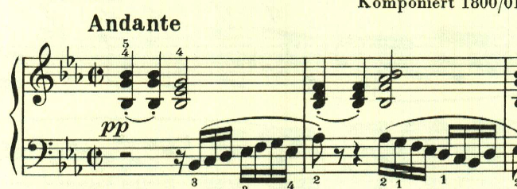
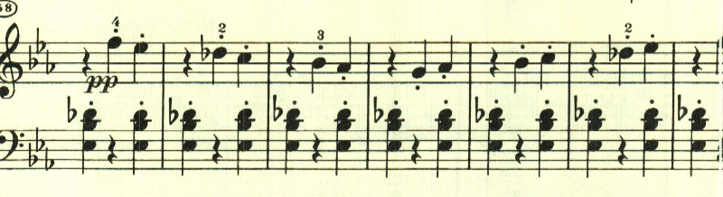

+++
title = "ベートーヴェン ピアノ・ソナタ 第13番"
+++

## 第1楽章

<iframe allow="autoplay *; encrypted-media *;" frameborder="0" height="150" sandbox="allow-forms allow-popups allow-same-origin allow-scripts allow-top-navigation-by-user-activation" src="https://embed.music.apple.com/us/album/piano-sonata-no-13-in-e-flat-major-op-27-no-1-quasi/1272663034?i=1272663705&app=music" width="660"></iframe>

ここから「幻想曲風ソナタ(SONATA QUASI UNA FANTASIA)」というタイトルが付くようになる。
霧の中をゆっくり進むような、和音を主としたテーマで始まる。

和音の中にテーマが浮かぶ。

ここも和音主体であるが、少し雰囲気が変わる。

ここで突如として高速なパッセージとなるが、やはりアルペジオ主体で和音へのこだわりがある。

最初のテーマが繰り返されて終わる。

## 第2楽章

<iframe allow="autoplay *; encrypted-media *;" frameborder="0" height="150" sandbox="allow-forms allow-popups allow-same-origin allow-scripts allow-top-navigation-by-user-activation" src="https://embed.music.apple.com/us/album/piano-sonata-no-13-in-e-flat-major-op-27-no-1-quasi/1272663034?i=1272663706&app=music" width="660"></iframe>

第2楽章は、アルペジオ主体の速い楽章。

極めて単純なパッセージを縦横無尽に展開する様は見事だ。

中間部も非常に単純なパッセージで見事な効果を上げている。

再度最初のテーマが繰り返される。最後は、8分音符分のずれを伴って劇的に終わる。

## 第3楽章

<iframe allow="autoplay *; encrypted-media *;" frameborder="0" height="150" sandbox="allow-forms allow-popups allow-same-origin allow-scripts allow-top-navigation-by-user-activation" src="https://embed.music.apple.com/us/album/piano-sonata-no-13-in-e-flat-major-op-27-no-1-quasi/1272663034?i=1272663707&app=music" width="660"></iframe>

第3楽章は、序奏を伴っている。序奏はゆっくりとした風を感じさせる。

序奏が終わると対照的な速い主部が開始される。

非常に単純なアルペジオだた、曲全体で繰り返し使用される。

ここもアルペジオ主体の単純なテーマが元気良く奏される。

ここで左手に現れるテーマは、最初のテーマの変形と思われる。

ここでは右手に現れる。

ここも最初のテーマの変形。

最後に終わりを告げるテーマが現れてクライマックスに逹っする。

序奏部が繰り返されて、劇的な効果を上げている。

最後はプレストで華々しく終わる。
規模的にも単純なテーマを様々に活用するスタイルも、オーソドックスなベートーヴェンのソナタの完成が見られる。

楽譜引用はヘンレ版から。

