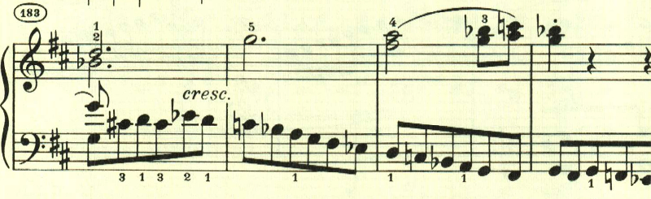
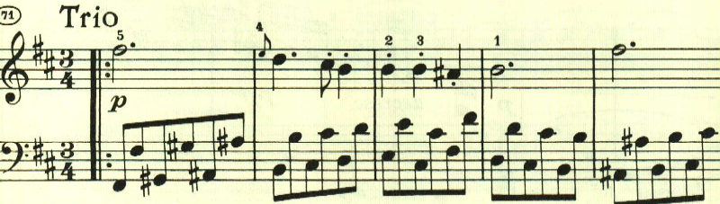

+++
title = "ベートーヴェン ピアノ・ソナタ 第15番"
+++

## 第1楽章

<iframe allow="autoplay *; encrypted-media *;" frameborder="0" height="150" sandbox="allow-forms allow-popups allow-same-origin allow-scripts allow-top-navigation-by-user-activation" src="https://embed.music.apple.com/us/album/piano-sonata-no-15-in-d-major-op-28-i-allegro/1272663034?i=1272663709&app=music" width="660"></iframe>

15番は、通奏低音が特徴的な曲で一般に「田園」という通称で知られる。

この曲も初期の曲と同じく、色々なテーマが登場する。

特徴的な2つ目のテーマは最初は幻想的な雰囲気の中に浮かび上がるかのようで、メロディーらしきものが見当たらない。

その後にテーマが現れる。

展開部も長調のままで開始する。

展開部は、最初と違って新しいテーマは使われずに、提示されたテーマが繰り返し使われる。

再現部。

一通り再現が終わった後に、もう一度最初のテーマが現れて終わる。

## 第2楽章

<iframe allow="autoplay *; encrypted-media *;" frameborder="0" height="150" sandbox="allow-forms allow-popups allow-same-origin allow-scripts allow-top-navigation-by-user-activation" src="https://embed.music.apple.com/us/album/piano-sonata-no-15-in-d-major-op-28-ii-andante/1272663034?i=1272663710&app=music" width="660"></iframe>

15番では4楽章に戻っており、第2楽章はスタカートの左手の上に憂鬱なテーマが進む。

2つ目のテーマも、短調のまま継続。

ここからは長調となりリズミカルなテーマが展開される。

最初のテーマが再現される。

ここからはテーマが16分音符で変奏され、最後は静かに終わる。

## 第3楽章

<iframe allow="autoplay *; encrypted-media *;" frameborder="0" height="150" sandbox="allow-forms allow-popups allow-same-origin allow-scripts allow-top-navigation-by-user-activation" src="https://embed.music.apple.com/us/album/piano-sonata-no-15-in-d-major-op-28-iii-scherzo-allegro-vivace/1272663034?i=1272663711&app=music" width="660"></iframe>

第3楽章にはオーソドックスにスケルツォが配置されている。
この楽章は、単純な音型が基礎になっているものの、あまり展開はされない。最初はオクターブで進む単純な音型。

ここから左手に移る。

曲全体は、複合三部形式となっていて、短調のトリオが続く。

D.C.で最初に戻り、最初のテーマが繰り返されて終わる。

## 第4楽章

<iframe allow="autoplay *; encrypted-media *;" frameborder="0" height="150" sandbox="allow-forms allow-popups allow-same-origin allow-scripts allow-top-navigation-by-user-activation" src="https://embed.music.apple.com/us/album/piano-sonata-no-15-in-d-major-op-28-iv-rondo-allegro/1272663034?i=1272663712&app=music" width="660"></iframe>

第4楽章はRondo。第1楽章と同じくニ長調であることもあり、曲全体で同じ雰囲気が持続している。Rondoとあるものの、左手で奏される八分音符と四分音符の組み合わせが、様々に展開されていく。

最後に終わりを告げるPrestoが現れるが、左手にはやはり最初のテーマが登場する。

楽譜の引用はヘンレ版。

