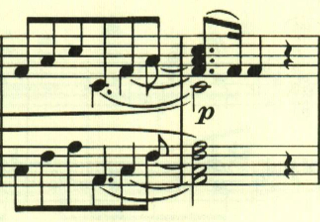

+++
title = "ベートーヴェン ピアノ・ソナタ第18番"
+++

## 第1楽章

<iframe allow="autoplay *; encrypted-media *;" frameborder="0" height="150" style="width:100%;max-width:660px;overflow:hidden;background:transparent;" sandbox="allow-forms allow-popups allow-same-origin allow-scripts allow-storage-access-by-user-activation allow-top-navigation-by-user-activation" src="https://embed.music.apple.com/us/album/piano-sonata-no-18-in-e-flat-major-op-31-i-allegro/960633853?i=960633866&app=music"></iframe>

17番までで幻想曲風ソナタはひとまず終了。18番は4楽章制の古典的なソナタへの回帰を見せているが、新しい試みも幾つか見られる。
第1楽章は、単純な音型で始まる。

この単純な音型も曲全体で何度も使われる。

この主題は旋律的で対照的だ。

展開部。2つ目の音型が主に使用される。

再現部。

## 第2楽章

<iframe allow="autoplay *; encrypted-media *;" frameborder="0" height="150" style="width:100%;max-width:660px;overflow:hidden;background:transparent;" sandbox="allow-forms allow-popups allow-same-origin allow-scripts allow-storage-access-by-user-activation allow-top-navigation-by-user-activation" src="https://embed.music.apple.com/us/album/piano-sonata-no-18-in-e-flat-major-op-31-ii-scherzo/960633853?i=960633867&app=music"></iframe>

第2楽章はこれまでの4楽章制ソナタであれば緩徐楽章が配置されるところだが、18番ではスケルツォが配置されている。スタカートが多用された軽快な走り回るかのような曲。

メロディよりもリズムとスタカートが重視されている。

最後はppで静かに終わる。

## 第3楽章

<iframe allow="autoplay *; encrypted-media *;" frameborder="0" height="150" style="width:100%;max-width:660px;overflow:hidden;background:transparent;" sandbox="allow-forms allow-popups allow-same-origin allow-scripts allow-storage-access-by-user-activation allow-top-navigation-by-user-activation" src="https://embed.music.apple.com/us/album/piano-sonata-no-18-in-e-flat-major-op-31-iii-menuetto/960633853?i=960633868&app=music"></iframe>

第3楽章は、どこか懐しい感じのする暖かなテーマで構成されたメヌエット。

2つ目のテーマも同じ雰囲気のもの。

トリオも長調で柔らかな雰囲気が続く。

最初の2つのテーマが繰り返される。

最後にコーダが置かれ、静かに終わる。

## 第4楽章

<iframe allow="autoplay *; encrypted-media *;" frameborder="0" height="150" style="width:100%;max-width:660px;overflow:hidden;background:transparent;" sandbox="allow-forms allow-popups allow-same-origin allow-scripts allow-storage-access-by-user-activation allow-top-navigation-by-user-activation" src="https://embed.music.apple.com/us/album/piano-sonata-no-18-in-e-flat-major-op-31-iv-presto-con-fuoco/960633853?i=960633869&app=music"></iframe>

第4楽章は、即興的なメロディの走り回っているかのような速い楽章。どのメロディも旋律というよりはリズムが特徴的だ。

このリズムは曲全体を通して繰り返し用いられる。

展開部。2番目のテーマのリズムが繰り返し用いられる。

再現部。

最後は、最初のテーマが繰り返されて終わる。

楽譜引用はヘンレ版から。

