+++
title = "ベートーヴェン ピアノ・ソナタ 第25番"
+++

## 第1楽章

<iframe allow="autoplay *; encrypted-media *;" style="width:100%;max-width:660px;overflow:hidden;background:transparent;" sandbox="allow-forms allow-popups allow-same-origin allow-scripts allow-storage-access-by-user-activation allow-top-navigation-by-user-activation" src="https://embed.music.apple.com/us/album/piano-sonata-no-25-in-g-major-op-79-i-presto-alla-tedesca/947851407?i=947851420&app=music" height="150" frameborder="0"></iframe>

ここに来て、第2楽章に緩徐楽章を配置する3楽章制の古典的なソナタに回帰する。
第1楽章は主題の音型から「かっこう」と呼ばれることがある。

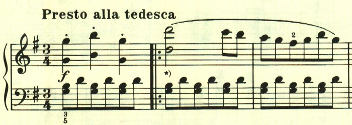

第1楽章は全体に明るいテーマで構成される。

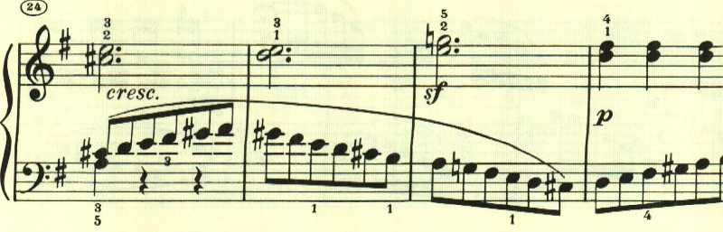

展開部は転調するが長調のまま。

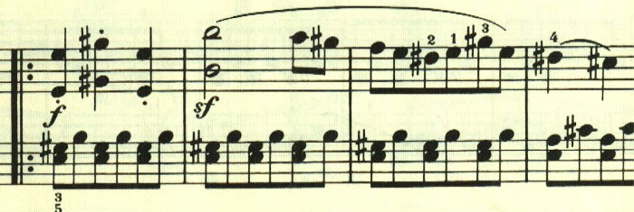

かっこうのテーマが展開される。

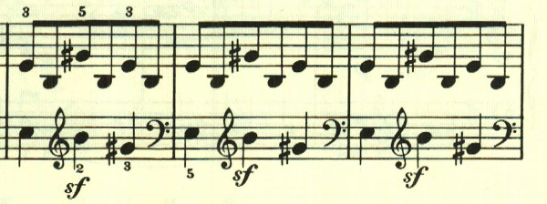

転調を織り交ぜるが、大きな発展は無くかっこうのテーマが繰り返される。

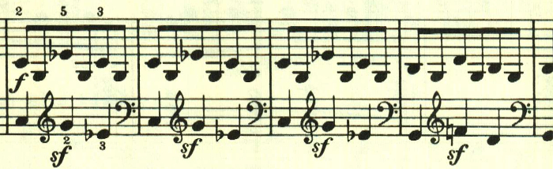

再現部。

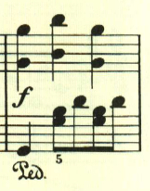
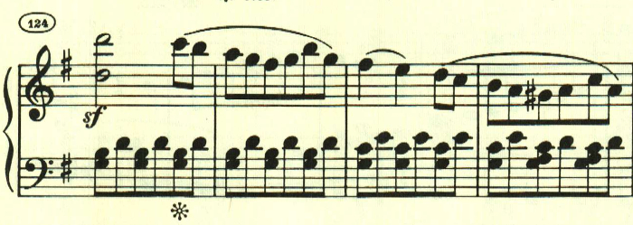

展開部と再現部は繰り返しとなっている。

再現部の後に終わりを告げるパートがあり、左手で最初のテーマが奏される。

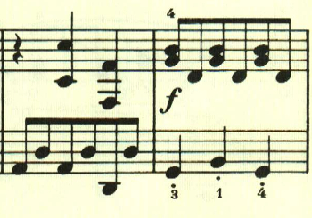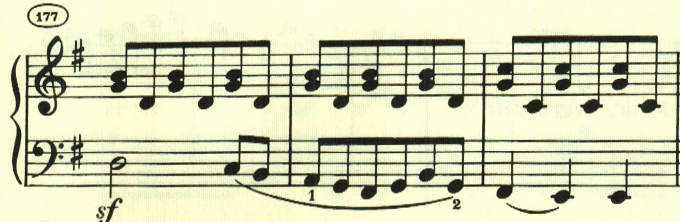

## 第2楽章

<iframe allow="autoplay *; encrypted-media *;" style="width:100%;max-width:660px;overflow:hidden;background:transparent;" sandbox="allow-forms allow-popups allow-same-origin allow-scripts allow-storage-access-by-user-activation allow-top-navigation-by-user-activation" src="https://embed.music.apple.com/us/album/piano-sonata-no-25-in-g-major-op-79-ii-andante/947851407?i=947851421&app=music" height="150" frameborder="0"></iframe>

三部形式。長い階段を登っていくかのような、あるいは人生の苦悩をつづるかのようなテーマで始まる。

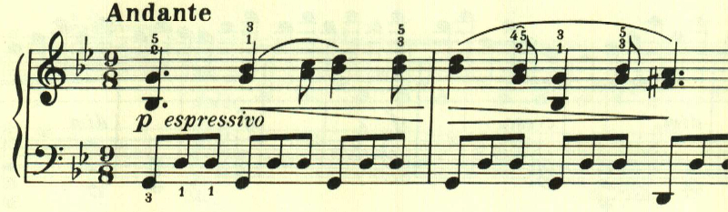

中間部は左手で流れるような16分音符が奏され、夢の中のような、あるいは暖かな風が吹いているかのような場面となる。

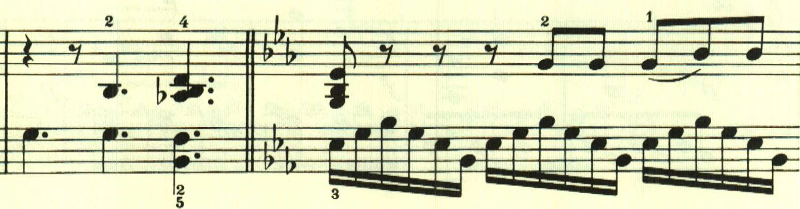

最初のテーマが繰り返される。

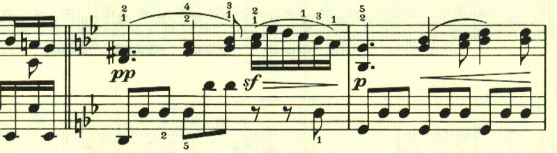

最初のテーマが右手に現れつつ、左手には中間部の流れる音型が組み合わされるという興味深い展開が現れて終わる。

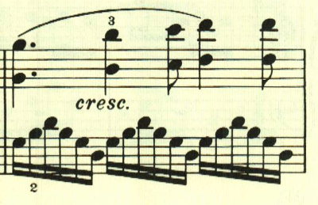

## 第3楽章

<iframe allow="autoplay *; encrypted-media *;" style="width:100%;max-width:660px;overflow:hidden;background:transparent;" sandbox="allow-forms allow-popups allow-same-origin allow-scripts allow-storage-access-by-user-activation allow-top-navigation-by-user-activation" src="https://embed.music.apple.com/us/album/piano-sonata-no-25-in-g-major-op-79-iii-vivace/947851407?i=947851422&app=music" height="150" frameborder="0"></iframe>

複合三部形式。なんとも陽気な民謡のようなテーマを用いた短い楽章。

踊っているかのような、あるいはおどけているかのようなテーマ。最初のテーマと、このテーマが曲全体で使われる。

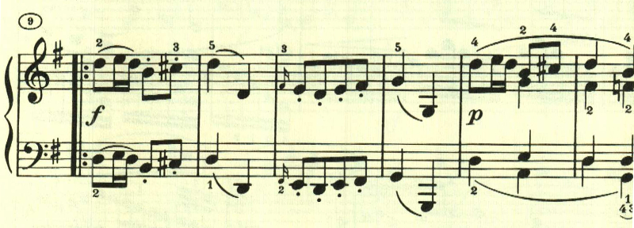

楽譜引用はヘンレ版から。
