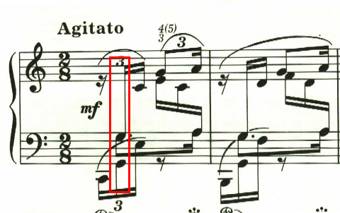
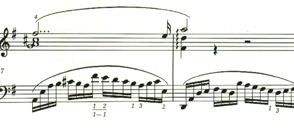
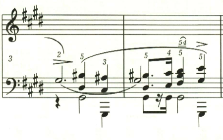
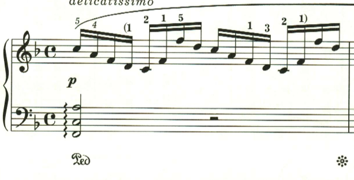

+++
title = "ショパン プレリュード"
+++

# ショパン・プレリュード第1曲

<iframe height="175" width="100%" title="Media player" src="https://embed.music.apple.com/us/album/24-pr%C3%A9ludes-op-28-1-agitato-in-c-major/1079750245?i=1079750247&amp;itscg=30200&amp;itsct=music_box_player&amp;ls=1&amp;app=music&amp;mttnsubad=1079750247&amp;theme=auto" id="embedPlayer" style="border:0;border-radius:12px;width:100%;height:175px;max-width:660px" sandbox="allow-forms allow-popups allow-same-origin allow-scripts allow-top-navigation-by-user-activation" allow="autoplay *; encrypted-media *; clipboard-write"></iframe>

さてプレリュードは、1曲目から謎が多い。

上声部と、下声部は16分音符の3連符だが、問題は中声部だ。もちろん2/8拍子なのだから符点8分音符と16分音符で問題は無いが、開始点がずれているので計算が合わない。では、中声部も実は3連符なのかというと、16分音符の3連符5つ分なので、やはり1つ分計算が合わない。

この曲は、一部だけ5連符へと微妙にリズムが変更されていて、ここも謎かけになっている。こちらは中声部の開始点がずれていないので、計算上、問題無いのだが、逆に他の部分はどういうわけなのだ、という感じ。色々とずれているものを、うまくまとめてみろというショパンからの挑戦状なのだろうか。

# ショパン・プレリュード第2曲

<iframe height="175" width="100%" title="Media player" src="https://embed.music.apple.com/us/album/24-pr%C3%A9ludes-op-28-2-lento-in-a-minor/1079750245?i=1079750248&amp;itscg=30200&amp;itsct=music_box_player&amp;ls=1&amp;app=music&amp;mttnsubad=1079750248&amp;theme=auto" id="embedPlayer" style="border:0;border-radius:12px;width:100%;height:175px;max-width:660px" sandbox="allow-forms allow-popups allow-same-origin allow-scripts allow-top-navigation-by-user-activation" allow="autoplay *; encrypted-media *; clipboard-write"></iframe>

第2曲は、左手で重々しい二重音が続く中、右手で同じ旋律が繰り返される。

最後に一瞬長調に転じるが、結局最後は短調で終わる。

# ショパン プレリュード 第3曲

<iframe height="175" width="100%" title="Media player" src="https://embed.music.apple.com/us/album/24-pr%C3%A9ludes-op-28-3-vivace-in-g-major/1079750245?i=1079750249&amp;itscg=30200&amp;itsct=music_box_player&amp;ls=1&amp;app=music&amp;mttnsubad=1079750249&amp;theme=auto" id="embedPlayer" style="border:0;border-radius:12px;width:100%;height:175px;max-width:660px" sandbox="allow-forms allow-popups allow-same-origin allow-scripts allow-top-navigation-by-user-activation" allow="autoplay *; encrypted-media *; clipboard-write"></iframe>

第3曲は、軽快な伴奏の上に、これまた軽快な複々符点音符のメロディが繰り返される。ただそれだけなのに、とてもエレガント。しかしこの左手をうまく弾くのは至難の技。

# ショパン プレリュード 第4曲

<iframe height="175" width="100%" title="Media player" src="https://embed.music.apple.com/us/album/24-pr%C3%A9ludes-op-28-4-largo-in-e-minor/1079750245?i=1079750250&amp;itscg=30200&amp;itsct=music_box_player&amp;ls=1&amp;app=music&amp;mttnsubad=1079750250&amp;theme=auto" id="embedPlayer" style="border:0;border-radius:12px;width:100%;height:175px;max-width:660px" sandbox="allow-forms allow-popups allow-same-origin allow-scripts allow-top-navigation-by-user-activation" allow="autoplay *; encrypted-media *; clipboard-write"></iframe>

第4曲は、左手の和音の連打の上に、悲壮感と葛藤を感じさせるメロディが奏でられる。最後はそれでも叶わぬ絶望とあきらめの中に靜かに曲を閉じる。

# ショパン・プレリュード 第5曲

<iframe height="175" width="100%" title="Media player" src="https://embed.music.apple.com/us/album/24-pr%C3%A9ludes-op-28-5-molto-allegro-in-d-major/1079750245?i=1079750251&amp;itscg=30200&amp;itsct=music_box_player&amp;ls=1&amp;app=music&amp;mttnsubad=1079750251&amp;theme=auto" id="embedPlayer" style="border:0;border-radius:12px;width:100%;height:175px;max-width:660px" sandbox="allow-forms allow-popups allow-same-origin allow-scripts allow-top-navigation-by-user-activation" allow="autoplay *; encrypted-media *; clipboard-write"></iframe>

第5曲は、音の洪水の中に、メロディともメロディともつかないような中声部が現れ、もやの中の景色のよう。

# ショパン・プレリュード 第6曲

<iframe height="175" width="100%" title="Media player" src="https://embed.music.apple.com/us/album/24-pr%C3%A9ludes-op-28-6-lento-assai-in-b-minor/1079750245?i=1079750252&amp;itscg=30200&amp;itsct=music_box_player&amp;ls=1&amp;app=music&amp;mttnsubad=1079750252&amp;theme=auto" id="embedPlayer" style="border:0;border-radius:12px;width:100%;height:175px;max-width:660px" sandbox="allow-forms allow-popups allow-same-origin allow-scripts allow-top-navigation-by-user-activation" allow="autoplay *; encrypted-media *; clipboard-write"></iframe>

第6曲は、右手の伴奏の中に左手で朗々とメロディが歌い上げられる。

途中メロディは爽快な長調に転じ、山を登っているかのよう。最後は最初のメロディに戻って靜かに曲を閉じる。

# ショパン・プレリュード 第7曲

<iframe height="175" width="100%" title="Media player" src="https://embed.music.apple.com/us/album/24-pr%C3%A9ludes-op-28-7-andantino-in-a-major/1079750245?i=1079750253&amp;itscg=30200&amp;itsct=music_box_player&amp;ls=1&amp;app=music&amp;mttnsubad=1079750253&amp;theme=auto" id="embedPlayer" style="border:0;border-radius:12px;width:100%;height:175px;max-width:660px" sandbox="allow-forms allow-popups allow-same-origin allow-scripts allow-top-navigation-by-user-activation" allow="autoplay *; encrypted-media *; clipboard-write"></iframe>

第7曲は、愛らしいメロディが繰り返される小品。

この曲でやっかいなのは、ここの和音。

右手は広い音域をおさえなければならないので、親指で2つの音を弾くように指定されている。そしてクレシェンドが指定されているが、スラーの最後の音なので音量は抑える必要があり、ここは音を揃えて弾くのが難しい。

# ショパン・プレリュード 第8曲

<iframe height="175" width="100%" title="Media player" src="https://embed.music.apple.com/us/album/24-pr%C3%A9ludes-op-28-8-molto-agitato-in-f-sharp-minor/1079750245?i=1079750254&amp;itscg=30200&amp;itsct=music_box_player&amp;ls=1&amp;app=music&amp;mttnsubad=1079750254&amp;theme=auto" id="embedPlayer" style="border:0;border-radius:12px;width:100%;height:175px;max-width:660px" sandbox="allow-forms allow-popups allow-same-origin allow-scripts allow-top-navigation-by-user-activation" allow="autoplay *; encrypted-media *; clipboard-write"></iframe>

第8曲は、終始同じリズムのパッセージが繰り返される中、中声部でメロディが奏でられる。

# ショパン・プレリュード第9曲

<iframe height="175" width="100%" title="Media player" src="https://embed.music.apple.com/us/album/24-pr%C3%A9ludes-op-28-9-largo-in-e-major/1079750245?i=1079750255&amp;itscg=30200&amp;itsct=music_box_player&amp;ls=1&amp;app=music&amp;mttnsubad=1079750255&amp;theme=auto" id="embedPlayer" style="border:0;border-radius:12px;width:100%;height:175px;max-width:660px" sandbox="allow-forms allow-popups allow-same-origin allow-scripts allow-top-navigation-by-user-activation" allow="autoplay *; encrypted-media *; clipboard-write"></iframe>

第9曲は、堂々としたテーマが歌われる。

後半は、リズムが複符点となり緊張感を増していき、フォルテシモで曲を閉じる。

# ショパン・プレリュード第10曲

<iframe height="175" width="100%" title="Media player" src="https://embed.music.apple.com/us/album/24-pr%C3%A9ludes-op-28-10-molto-allegro-in-c-sharp-minor/1079750245?i=1079750256&amp;itscg=30200&amp;itsct=music_box_player&amp;ls=1&amp;app=music&amp;mttnsubad=1079750256&amp;theme=auto" id="embedPlayer" style="border:0;border-radius:12px;width:100%;height:175px;max-width:660px" sandbox="allow-forms allow-popups allow-same-origin allow-scripts allow-top-navigation-by-user-activation" allow="autoplay *; encrypted-media *; clipboard-write"></iframe>

第10曲は、速い下降パッセージで、何かが転がり落ちるよう。

第2のパッセージは、動きのゆっくりとした落ち着いたもの。スラーの最後にアクセントがあり、何か疑問を投げかけているかのよう。

この第2のパッセージは、何度か登場するが、交互に微妙にスラーのかかり方が違い、一旦スラーが終了してからアクセントが来る。

# ショパン・プレリュード 第11曲

<iframe height="175" width="100%" title="Media player" src="https://embed.music.apple.com/us/album/24-pr%C3%A9ludes-op-28-11-vivace-in-b-major/1079750245?i=1079750257&amp;itscg=30200&amp;itsct=music_box_player&amp;ls=1&amp;app=music&amp;mttnsubad=1079750257&amp;theme=auto" id="embedPlayer" style="border:0;border-radius:12px;width:100%;height:175px;max-width:660px" sandbox="allow-forms allow-popups allow-same-origin allow-scripts allow-top-navigation-by-user-activation" allow="autoplay *; encrypted-media *; clipboard-write"></iframe>

第11曲は、穏やかで、普段の何も変わらない生活を思わせるような靜かな曲。

# ショパン・プレリュード 第12曲

<iframe height="175" width="100%" title="Media player" src="https://embed.music.apple.com/us/album/24-pr%C3%A9ludes-op-28-12-presto-in-g-sharp-minor/1079750245?i=1079750258&amp;itscg=30200&amp;itsct=music_box_player&amp;ls=1&amp;app=music&amp;mttnsubad=1079750258&amp;theme=auto" id="embedPlayer" style="border:0;border-radius:12px;width:100%;height:175px;max-width:660px" sandbox="allow-forms allow-popups allow-same-origin allow-scripts allow-top-navigation-by-user-activation" allow="autoplay *; encrypted-media *; clipboard-write"></iframe>

第12曲は、11曲とはうって変わって、激しい怒りを表すかのような曲。

次第に音が増えていき、和音を高速で弾かなければならなくなる。

# ショパン・プレリュード第13曲

<iframe height="175" width="100%" title="Media player" src="https://embed.music.apple.com/us/album/24-pr%C3%A9ludes-op-28-13-lento-in-f-sharp-major/1079750245?i=1079750259&amp;itscg=30200&amp;itsct=music_box_player&amp;ls=1&amp;app=music&amp;mttnsubad=1079750259&amp;theme=auto" id="embedPlayer" style="border:0;border-radius:12px;width:100%;height:175px;max-width:660px" sandbox="allow-forms allow-popups allow-same-origin allow-scripts allow-top-navigation-by-user-activation" allow="autoplay *; encrypted-media *; clipboard-write"></iframe>

第13曲は、夢の中で空を浮遊しているかのような幻想的な音楽。

途中でテンポが遅くなり、短調になるがすぐに長調に戻るということが繰り返される。

最後に最初のテンポに戻る指定。しかし、ここは曲想的には緊張感が高まっているため、最初のテンポよりも速めに弾かれることが多いと思われる。

# ショパン・プレリュード第14曲

<iframe height="175" width="100%" title="Media player" src="https://embed.music.apple.com/us/album/24-pr%C3%A9ludes-op-28-14-allegro-in-e-flat-minor/1079750245?i=1079750260&amp;itscg=30200&amp;itsct=music_box_player&amp;ls=1&amp;app=music&amp;mttnsubad=1079750260&amp;theme=auto" id="embedPlayer" style="border:0;border-radius:12px;width:100%;height:175px;max-width:660px" sandbox="allow-forms allow-popups allow-same-origin allow-scripts allow-top-navigation-by-user-activation" allow="autoplay *; encrypted-media *; clipboard-write"></iframe>

第14曲は、抗い難い流れ、あるいは侵略を表したかのような明確なメロディの無い音楽。

# ショパン・プレリュード 第15曲

<iframe height="175" width="100%" title="Media player" src="https://embed.music.apple.com/us/album/24-pr%C3%A9ludes-op-28-15-sostenuto-in-d-flat-major/1079750245?i=1079750651&amp;itscg=30200&amp;itsct=music_box_player&amp;ls=1&amp;app=music&amp;mttnsubad=1079750651&amp;theme=auto" id="embedPlayer" style="border:0;border-radius:12px;width:100%;height:175px;max-width:660px" sandbox="allow-forms allow-popups allow-same-origin allow-scripts allow-top-navigation-by-user-activation" allow="autoplay *; encrypted-media *; clipboard-write"></iframe>

第15曲は「雨だれ」として良く知られているが、譜面には記載は無い。繰り返される変イ音が、雨だれのよう繰り返されることから命名されたのだろう。

曲は3部で構成され、中間部は短調になるが、同じ音が繰り返されるのは変わらない。

中間部は不気味な左和音が繰り返された後、ffで和音が強打される。嵐の描写なのであれば、雨だれのリズムが変わらないのは不自然なので、単なる描写音楽では無いと思われる。ショパンはこの頃、肺結核をこじらせていたと言われており、自分の健康面への不安やいら立ちを表現したのかもしれない。

最後の、この音型はあたかも雨上がりに陽が差してきたが、まだ雨は残っている、そんな状況を表したかのようだ。

# ショパン・プレリュード 第16曲

<iframe height="175" width="100%" title="Media player" src="https://embed.music.apple.com/us/album/24-pr%C3%A9ludes-op-28-16-presto-con-fuoco-in-b-flat-minor/1079750245?i=1079750652&amp;itscg=30200&amp;itsct=music_box_player&amp;ls=1&amp;app=music&amp;mttnsubad=1079750652&amp;theme=auto" id="embedPlayer" style="border:0;border-radius:12px;width:100%;height:175px;max-width:660px" sandbox="allow-forms allow-popups allow-same-origin allow-scripts allow-top-navigation-by-user-activation" allow="autoplay *; encrypted-media *; clipboard-write"></iframe>

第16曲は、15曲とは対照的に、激しい怒りを表現したかのような曲。

# ショパン・プレリュード 第17曲

<iframe height="175" width="100%" title="Media player" src="https://embed.music.apple.com/us/album/24-pr%C3%A9ludes-op-28-17-allegretto-in-a-flat-major/1079750245?i=1079750653&amp;itscg=30200&amp;itsct=music_box_player&amp;ls=1&amp;app=music&amp;mttnsubad=1079750653&amp;theme=auto" id="embedPlayer" style="border:0;border-radius:12px;width:100%;height:175px;max-width:660px" sandbox="allow-forms allow-popups allow-same-origin allow-scripts allow-top-navigation-by-user-activation" allow="autoplay *; encrypted-media *; clipboard-write"></iframe>

第17曲は、宙を舞うような幻想的な音楽。

最後は、sotto voce(ささやくように)。左手で同じ低音を小節の頭で繰り返し奏される中、ppで幻想的なメロディが繰り返されて靜かに曲を閉じる。

# ショパン・プレリュード 第18曲

<iframe height="175" width="100%" title="Media player" src="https://embed.music.apple.com/us/album/24-pr%C3%A9ludes-op-28-18-molto-allegro-in-f-minor/1079750245?i=1079750654&amp;itscg=30200&amp;itsct=music_box_player&amp;ls=1&amp;app=music&amp;mttnsubad=1079750654&amp;theme=auto" id="embedPlayer" style="border:0;border-radius:12px;width:100%;height:175px;max-width:660px" sandbox="allow-forms allow-popups allow-same-origin allow-scripts allow-top-navigation-by-user-activation" allow="autoplay *; encrypted-media *; clipboard-write"></iframe>

第18曲は難解なリズムで、緩急の大きな曲。

連符も多用され、曲を通じて不規則なリズムが続く。

# ショパン・プレリュード 第19曲

<iframe height="175" width="100%" title="Media player" src="https://embed.music.apple.com/us/album/24-pr%C3%A9ludes-op-28-19-vivace-in-e-flat-major/1079750245?i=1079750655&amp;itscg=30200&amp;itsct=music_box_player&amp;ls=1&amp;app=music&amp;mttnsubad=1079750655&amp;theme=auto" id="embedPlayer" style="border:0;border-radius:12px;width:100%;height:175px;max-width:660px" sandbox="allow-forms allow-popups allow-same-origin allow-scripts allow-top-navigation-by-user-activation" allow="autoplay *; encrypted-media *; clipboard-write"></iframe>

第19曲は、雲の上へと上昇していくかのような軽快な曲。大きな音の跳躍を必要とする。

# ショパン・プレリュード 第20曲

<iframe height="175" width="100%" title="Media player" src="https://embed.music.apple.com/us/album/24-pr%C3%A9ludes-op-28-20-largo-in-c-minor/1079750245?i=1079750656&amp;itscg=30200&amp;itsct=music_box_player&amp;ls=1&amp;app=music&amp;mttnsubad=1079750656&amp;theme=auto" id="embedPlayer" style="border:0;border-radius:12px;width:100%;height:175px;max-width:660px" sandbox="allow-forms allow-popups allow-same-origin allow-scripts allow-top-navigation-by-user-activation" allow="autoplay *; encrypted-media *; clipboard-write"></iframe>

第20曲は、荘厳な宗教曲を思わせる曲。

この音はエキエル版ではフラット付になっているが、これまで見た楽譜の多くではフラット無しだったので、妙な感じがする。

## ショパン・プレリュード第21曲

<iframe height="175" width="100%" title="Media player" src="https://embed.music.apple.com/us/album/24-pr%C3%A9ludes-op-28-21-cantabile-in-b-flat-major/1079750245?i=1079750657&amp;itscg=30200&amp;itsct=music_box_player&amp;ls=1&amp;app=music&amp;mttnsubad=1079750657&amp;theme=auto" id="embedPlayer" style="border:0;border-radius:12px;width:100%;height:175px;max-width:660px" sandbox="allow-forms allow-popups allow-same-origin allow-scripts allow-top-navigation-by-user-activation" allow="autoplay *; encrypted-media *; clipboard-write"></iframe>

第21曲は、平和な日常のような、あるいは爽やかな風の吹く野原を歩くかのような軽快なメロディで始まる。

ここから、不思議な響きのパッセージに変わる。鐘が鳴り響いているような、あるいは何か広い見晴しの良いところに出てきたかのよう。

同じパッセージは、ppで繰り返され、遠ざかっていったかのよう。その後、最初のメロディが繰り返されて曲を閉じる。

## ショパン・プレリュード第22曲

<iframe height="175" width="100%" title="Media player" src="https://embed.music.apple.com/us/album/24-pr%C3%A9ludes-op-28-22-molto-agitato-in-g-minor/1079750245?i=1079750658&amp;itscg=30200&amp;itsct=music_box_player&amp;ls=1&amp;app=music&amp;mttnsubad=1079750658&amp;theme=auto" id="embedPlayer" style="border:0;border-radius:12px;width:100%;height:175px;max-width:660px" sandbox="allow-forms allow-popups allow-same-origin allow-scripts allow-top-navigation-by-user-activation" allow="autoplay *; encrypted-media *; clipboard-write"></iframe>

第22曲も、第18曲と並んで、なんとも難解なリズムの激しい曲。

## ショパン・プレリュード 第23曲

<iframe height="175" width="100%" title="Media player" src="https://embed.music.apple.com/us/album/24-pr%C3%A9ludes-op-28-23-moderato-in-f-major/1079750245?i=1079750659&amp;itscg=30200&amp;itsct=music_box_player&amp;ls=1&amp;app=music&amp;mttnsubad=1079750659&amp;theme=auto" id="embedPlayer" style="border:0;border-radius:12px;width:100%;height:175px;max-width:660px" sandbox="allow-forms allow-popups allow-same-origin allow-scripts allow-top-navigation-by-user-activation" allow="autoplay *; encrypted-media *; clipboard-write"></iframe>

第23曲は、のどかな春の陽だまりのようなおだやかな曲。

## ショパン・プレリュード 第24曲

<iframe height="175" width="100%" title="Media player" src="https://embed.music.apple.com/us/album/24-pr%C3%A9ludes-op-28-24-allegro-appassionato-in-d-minor/1079750245?i=1079750660&amp;itscg=30200&amp;itsct=music_box_player&amp;ls=1&amp;app=music&amp;mttnsubad=1079750660&amp;theme=auto" id="embedPlayer" style="border:0;border-radius:12px;width:100%;height:175px;max-width:660px" sandbox="allow-forms allow-popups allow-same-origin allow-scripts allow-top-navigation-by-user-activation" allow="autoplay *; encrypted-media *; clipboard-write"></iframe>

第24曲は、荒々しい伴奏で始まる、左手で連打されるD音は鐘の音なのだろうか。

中間部は通常なら長調に変わるところだが、ここも短調で継続することで緊張感を持続する。それでも少し状況は柔らいで、どこか普段の生活に戻ったかのような感覚を覚える。

しかし、そんな穏やかなパッセージも弱く消えいっていき、最初の荒々しいメロディがユニゾンで返ってくる。

ピアニスト泣かせの、怒涛の3度が転がり落ちる。

最後も劇的なD音の連打で終わる。

楽譜引用はエキエル版から
