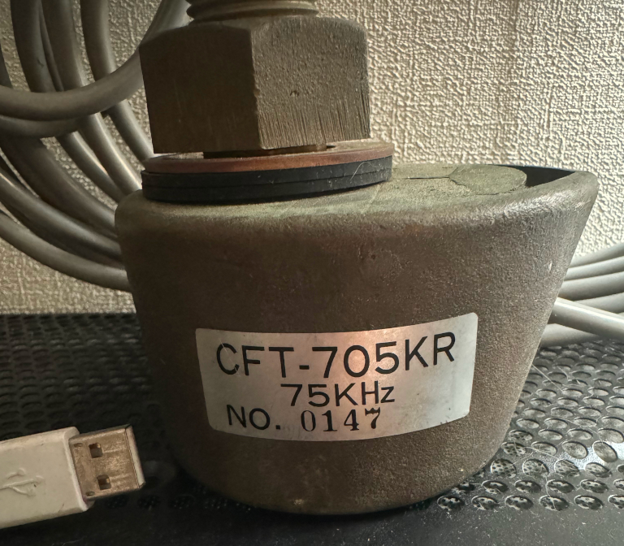
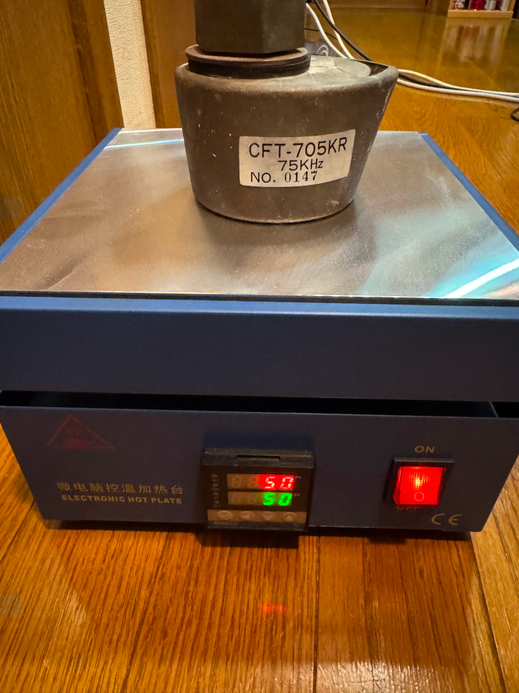

# 超音波振動子の測定

40年くらい前に秋月で買ったもの。確か魚群探知機から外したものという説明だった気がする。ずっと放置していたのだが、これを使って超音波洗浄器を作りたい。

<figure markdown="span">

<figcaption>超音波振動子</figcaption>
</figure markdown="span">

左は大きさ比較用のUSBコネクタ。結構大きい。Analog Discovery 3を手に入れたのでインピーダンスを測定してみた。

75kHzと書かれているので、このあたりでインピーダンスが最低になるのだろうと思っていたが、やはり測定器があるのはありがたい。900kHzあたりで最低になるようだ(室温25℃くらい)。多分温度がある程度上がると75kHzに近付いていくのだろう。

そこで50℃に加熱してみる。

再度測定すると...

変わらない。もしかして壊れているのかな、これ。

[Analog Discovery 3記事一覧](/ruimo-blog/blog/category/analog-discovery-3)

[超音波洗浄器記事一覧](/ruimo-blog/blog/category/超音波洗浄器)
