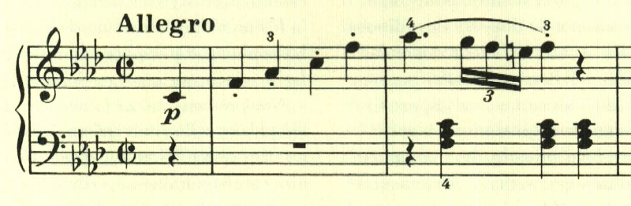
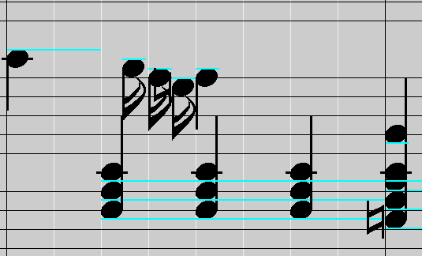

# ベートーヴェン ピアノ ソナタ 第1番 第1楽章

<iframe height="175" width="100%" title="Media player" src="https://embed.music.apple.com/us/album/piano-sonata-no-1-in-f-minor-op-2-no-1-i-allegro/1264640017?i=1264640151&amp;itscg=30200&amp;itsct=music_box_player&amp;ls=1&amp;app=music&amp;mttnsubad=1264640151&amp;theme=auto" id="embedPlayer" style="border:0;border-radius:12px;width:100%;height:175px;max-width:660px" sandbox="allow-forms allow-popups allow-same-origin allow-scripts allow-top-navigation-by-user-activation" allow="autoplay *; encrypted-media *; clipboard-write"></iframe>

ハイドンに献呈されたソナタ。初期のベートーヴェンのピアノソナタは、「速いパッセージを軽やかに弾く」ことを要求される。ベートーヴェン自身がピアノの名手だったことから、その技巧の披露の目的もあったのだと思われる。この曲も、16分音符の3連符が多用されており、これは楽譜の指示通りだとかなり速い。

楽譜では余裕のある書き方になっているが、正確な長さを考慮すると、16分音符の3連符の長さというのは以下のようになる。

実際には多くの演奏では、以下のように単なる16分音符の長さに近い演奏が多いように思う。

展開部は長調で始まるものの、すぐに短調に戻る。

この部分は、目立ったメロディも無く、なんともベートーヴェンらしい。

楽譜の引用はヘンレ版。
