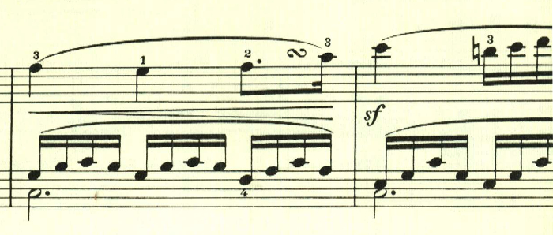
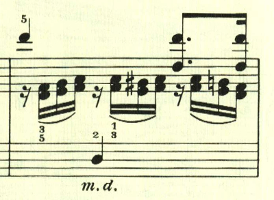
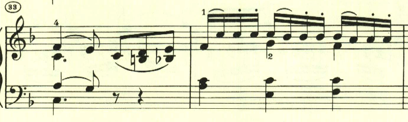

# ベートーヴェン ピアノ ソナタ 第1番 第2楽章

<iframe height="175" width="100%" title="Media player" src="https://embed.music.apple.com/us/album/piano-sonata-no-1-in-f-minor-op-2-no-1-ii-adagio/1264640017?i=1264640153&amp;itscg=30200&amp;itsct=music_box_player&amp;ls=1&amp;app=music&amp;mttnsubad=1264640153&amp;theme=auto" id="embedPlayer" style="border:0;border-radius:12px;width:100%;height:175px;max-width:660px" sandbox="allow-forms allow-popups allow-same-origin allow-scripts allow-top-navigation-by-user-activation" allow="autoplay *; encrypted-media *; clipboard-write"></iframe>

曲は三部形式で構成される。ベートーヴェンの緩徐楽章には、独特の暖かさがある。

暖かな日に青空を見上げるかのようなメロディが続く

中間部は短調となり、左手で不安な3度が奏でられる。

最初のテーマが、若干の変化を伴って繰り返される。

楽譜引用はヘンレ版。
