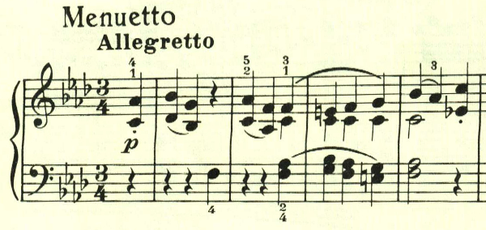
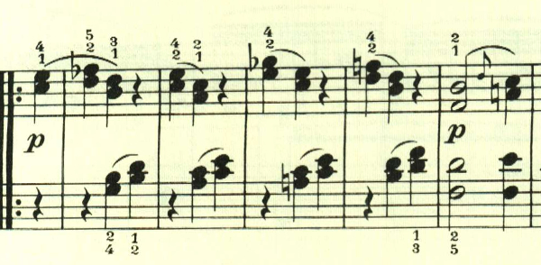
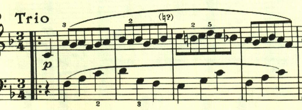
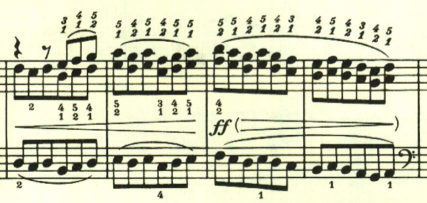

# ベートーヴェン ピアノ・ソナタ第1番 第3楽章

<iframe height="175" width="100%" title="Media player" src="https://embed.music.apple.com/us/album/piano-sonata-no-1-in-f-minor-op-2-no-1-iii-menuetto-allegretto/1264640017?i=1264640154&amp;itscg=30200&amp;itsct=music_box_player&amp;ls=1&amp;app=music&amp;mttnsubad=1264640154&amp;theme=auto" id="embedPlayer" style="border:0;border-radius:12px;width:100%;height:175px;max-width:660px" sandbox="allow-forms allow-popups allow-same-origin allow-scripts allow-top-navigation-by-user-activation" allow="autoplay *; encrypted-media *; clipboard-write"></iframe>

ベートーヴェンの初期のピアノソナタは、4楽章構成が多く、第3楽章は短かめなものでフィナーレにつなげるケースが多い。第1番の第3楽章のメヌエットも、そういう性格の曲になっている。

最初の繰り返しの後も、同様の音型が続くが、最初とはスラーのかかり方を変えることで飽きさせない。

トリオは長調に転じ、流れるような音型となり対照的である。

さらりと、やっかいな二重音を挟んでくる。初期のソナタは要所に難しいパッセージが散りばめられるケースが多い。

D.C.で最初のメロディが繰り返されて終わる。

楽譜の引用はヘンレ版
