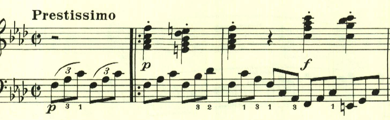
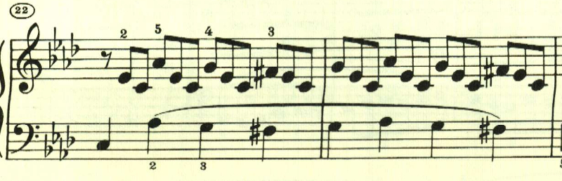
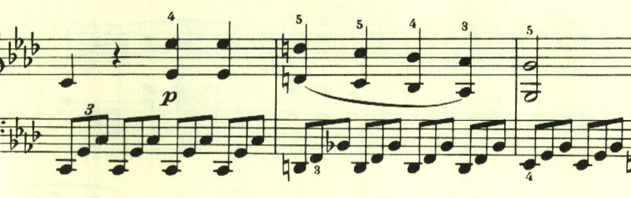
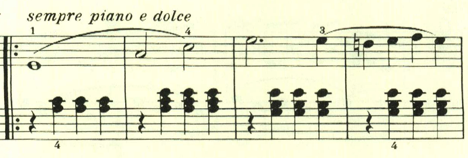
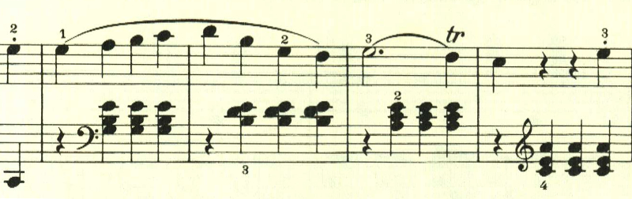
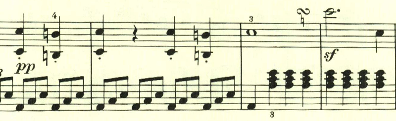

# ベートーヴェン・ピアノソナタ・第1番 第4楽章

<iframe height="175" width="100%" title="Media player" src="https://embed.music.apple.com/us/album/piano-sonata-no-1-in-f-minor-op-2-no-1-iv-prestissimo/1264640017?i=1264640155&amp;itscg=30200&amp;itsct=music_box_player&amp;ls=1&amp;app=music&amp;mttnsubad=1264640155&amp;theme=auto" id="embedPlayer" style="border:0;border-radius:12px;width:100%;height:175px;max-width:660px" sandbox="allow-forms allow-popups allow-same-origin allow-scripts allow-top-navigation-by-user-activation" allow="autoplay *; encrypted-media *; clipboard-write"></iframe>

最終楽章は、プレスティシモでピアノとフォルテをスタカートで繰り返すダイナミックな音型で始まる。

2つ目のテーマは、最初のテーマと対照的に憂鬱に上下する滑らかな旋律で、右手と左手とで同時に奏でられる。

下降するテーマが繰り返された後に、1つ目のテーマにつながっていく様は見事だ。

展開部は、長調となり左手の三連符が止んで、まるで雨が上がったかのようだ。

新たなテーマが展開を伴って繰り返される。

この曲は様々なテーマが現れて、若き日の意欲的なベートヴェンを思わせるが、再現部に入るまでのこの部分は、何度も最初のテーマが繰り返されて使用され、1つのテーマを様々に活用する往年のベートーヴェンの片鱗を伺わせる。

楽譜引用はヘンレ版
