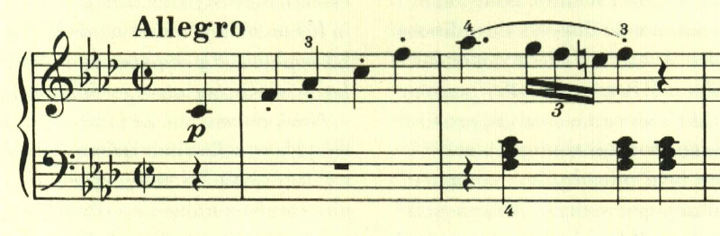
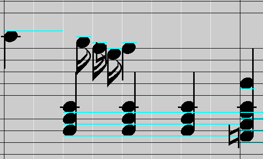
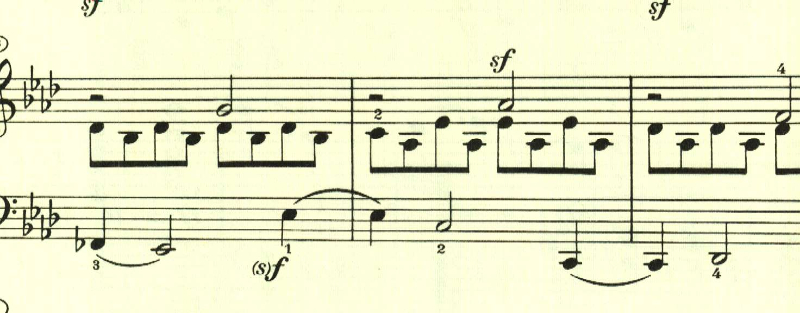
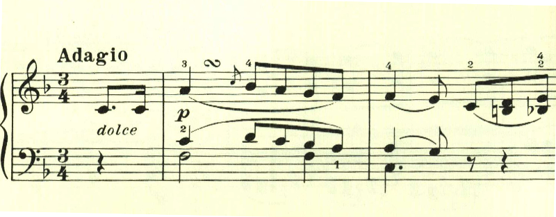
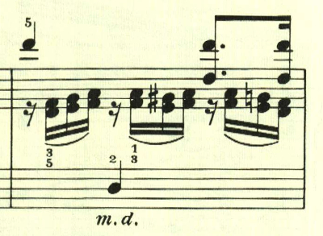
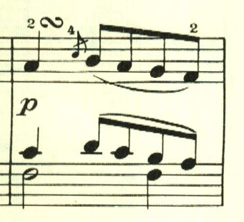
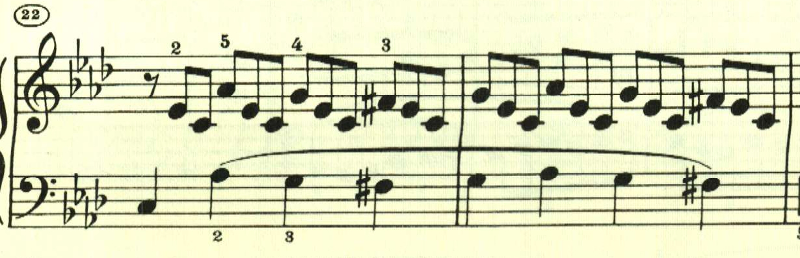
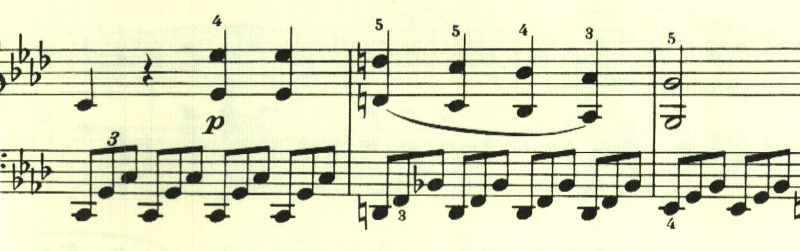
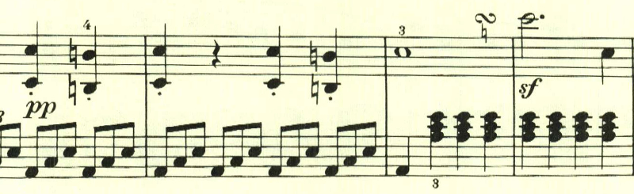

# ベートーヴェン ピアノ ソナタ 第1番

## 第1楽章

<iframe height="175" width="100%" title="Media player" src="https://embed.music.apple.com/us/album/piano-sonata-no-1-in-f-minor-op-2-no-1-i-allegro/1264640017?i=1264640151&amp;itscg=30200&amp;itsct=music_box_player&amp;ls=1&amp;app=music&amp;mttnsubad=1264640151&amp;theme=auto" id="embedPlayer" style="border:0;border-radius:12px;width:100%;height:175px;max-width:660px" sandbox="allow-forms allow-popups allow-same-origin allow-scripts allow-top-navigation-by-user-activation" allow="autoplay *; encrypted-media *; clipboard-write"></iframe>

ハイドンに献呈されたソナタ。初期のベートーヴェンのピアノソナタは、「速いパッセージを軽やかに弾く」ことを要求される。ベートーヴェン自身がピアノの名手だったことから、その技巧の披露の目的もあったのだと思われる。この曲も、16分音符の3連符が多用されており、これは楽譜の指示通りだとかなり速い。

楽譜では余裕のある書き方になっているが、正確な長さを考慮すると、16分音符の3連符の長さというのは以下のようになる。

実際には多くの演奏では、以下のように単なる16分音符の長さに近い演奏が多いように思う。

展開部は長調で始まるものの、すぐに短調に戻る。

この部分は、目立ったメロディも無く、なんともベートーヴェンらしい。

## 第2楽章

<iframe height="175" width="100%" title="Media player" src="https://embed.music.apple.com/us/album/piano-sonata-no-1-in-f-minor-op-2-no-1-ii-adagio/1264640017?i=1264640153&amp;itscg=30200&amp;itsct=music_box_player&amp;ls=1&amp;app=music&amp;mttnsubad=1264640153&amp;theme=auto" id="embedPlayer" style="border:0;border-radius:12px;width:100%;height:175px;max-width:660px" sandbox="allow-forms allow-popups allow-same-origin allow-scripts allow-top-navigation-by-user-activation" allow="autoplay *; encrypted-media *; clipboard-write"></iframe>

曲は三部形式で構成される。ベートーヴェンの緩徐楽章には、独特の暖かさがある。

暖かな日に青空を見上げるかのようなメロディが続く

中間部は短調となり、左手で不安な3度が奏でられる。

最初のテーマが、若干の変化を伴って繰り返される。

## 第3楽章

<iframe height="175" width="100%" title="Media player" src="https://embed.music.apple.com/us/album/piano-sonata-no-1-in-f-minor-op-2-no-1-iii-menuetto-allegretto/1264640017?i=1264640154&amp;itscg=30200&amp;itsct=music_box_player&amp;ls=1&amp;app=music&amp;mttnsubad=1264640154&amp;theme=auto" id="embedPlayer" style="border:0;border-radius:12px;width:100%;height:175px;max-width:660px" sandbox="allow-forms allow-popups allow-same-origin allow-scripts allow-top-navigation-by-user-activation" allow="autoplay *; encrypted-media *; clipboard-write"></iframe>

ベートーヴェンの初期のピアノソナタは、4楽章構成が多く、第3楽章は短かめなものでフィナーレにつなげるケースが多い。第1番の第3楽章のメヌエットも、そういう性格の曲になっている。

最初の繰り返しの後も、同様の音型が続くが、最初とはスラーのかかり方を変えることで飽きさせない。

トリオは長調に転じ、流れるような音型となり対照的である。

さらりと、やっかいな二重音を挟んでくる。初期のソナタは要所に難しいパッセージが散りばめられるケースが多い。

D.C.で最初のメロディが繰り返されて終わる。

# 第4楽章

<iframe height="175" width="100%" title="Media player" src="https://embed.music.apple.com/us/album/piano-sonata-no-1-in-f-minor-op-2-no-1-iv-prestissimo/1264640017?i=1264640155&amp;itscg=30200&amp;itsct=music_box_player&amp;ls=1&amp;app=music&amp;mttnsubad=1264640155&amp;theme=auto" id="embedPlayer" style="border:0;border-radius:12px;width:100%;height:175px;max-width:660px" sandbox="allow-forms allow-popups allow-same-origin allow-scripts allow-top-navigation-by-user-activation" allow="autoplay *; encrypted-media *; clipboard-write"></iframe>

最終楽章は、プレスティシモでピアノとフォルテをスタカートで繰り返すダイナミックな音型で始まる。

2つ目のテーマは、最初のテーマと対照的に憂鬱に上下する滑らかな旋律で、右手と左手とで同時に奏でられる。

下降するテーマが繰り返された後に、1つ目のテーマにつながっていく様は見事だ。

展開部は、長調となり左手の三連符が止んで、まるで雨が上がったかのようだ。

新たなテーマが展開を伴って繰り返される。

この曲は様々なテーマが現れて、若き日の意欲的なベートヴェンを思わせるが、再現部に入るまでのこの部分は、何度も最初のテーマが繰り返されて使用され、1つのテーマを様々に活用する往年のベートーヴェンの片鱗を伺わせる。

楽譜引用はヘンレ版

