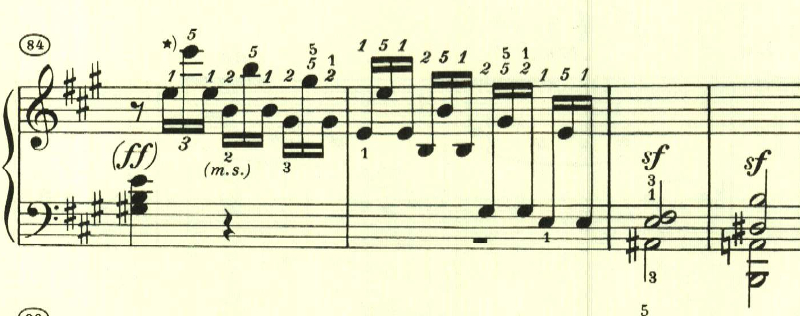

# ベートーヴェン ピアノ ソナタ第2番 第1楽章

<iframe height="175" width="100%" title="Media player" src="https://embed.music.apple.com/us/album/piano-sonata-no-2-in-a-major-op-2-no-2-i-allegro-vivace/1264640017?i=1264640156&amp;itscg=30200&amp;itsct=music_box_player&amp;ls=1&amp;app=music&amp;mttnsubad=1264640156&amp;theme=auto" id="embedPlayer" style="border:0;border-radius:12px;width:100%;height:175px;max-width:660px" sandbox="allow-forms allow-popups allow-same-origin allow-scripts allow-top-navigation-by-user-activation" allow="autoplay *; encrypted-media *; clipboard-write"></iframe>

おそらく、ベートーヴェンのピアノソナタの中でも、もっともマイナーなものの1つだが、様々な試みが見られる。第2番でも、要所で非常に速いパッセージが現れる。最初の32分音符も左右で粒を揃えて弾くことは難しい

次のテーマは、短調となり、不安のような葛藤のようなものを感じさせる。

ここの16分音符の3連符で構成されるトレモロも、指定通りの速度で弾くのが困難なパッセージだ。

展開部は、最初の主題が繰り返し使われ、ベートヴェンらしさが伺える。

装飾音と16分音符の3連符とを組み合わせたダイナミックな展開が行われる。

最後は、最初の主題が繰り返されて終わる。

楽譜引用はヘンレ版
