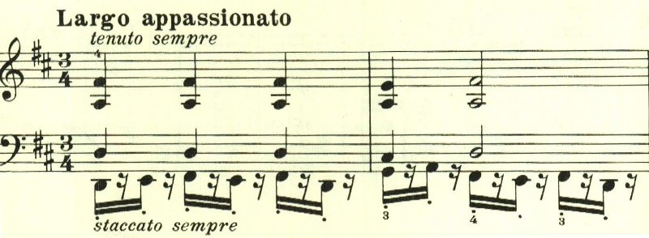

# ベートーヴェン ピアノ・ソナタ第2番 第2楽章

<iframe height="175" width="100%" title="Media player" src="https://embed.music.apple.com/us/album/piano-sonata-no-2-in-a-major-op-2-no-2-ii-largo-appassionato/1264640017?i=1264640158&amp;itscg=30200&amp;itsct=music_box_player&amp;ls=1&amp;app=music&amp;mttnsubad=1264640158&amp;theme=auto" id="embedPlayer" style="border:0;border-radius:12px;width:100%;height:175px;max-width:660px" sandbox="allow-forms allow-popups allow-same-origin allow-scripts allow-top-navigation-by-user-activation" allow="autoplay *; encrypted-media *; clipboard-write"></iframe>

暖かなメロディが特徴的な楽章。ゆっくりと歩いていくかのような左手のスタカートが特徴的。

第2楽章としては珍しく、最初のメロディの繰り返しの間に、様々なメロディがはさまれるロンド形式。

ここは、最初とスラーのかかり方が違い興味深い。

楽譜引用は、ヘンレ版。
