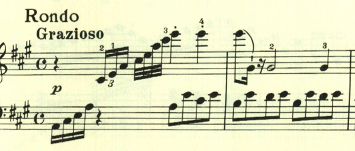

# ベートーヴェン ピアノソナタ第2番 第4楽章

<iframe height="175" width="100%" title="Media player" src="https://embed.music.apple.com/us/album/piano-sonata-no-2-in-a-major-op-2-no-2-iv-rondo-grazioso/1264640017?i=1264640160&amp;itscg=30200&amp;itsct=music_box_player&amp;ls=1&amp;app=music&amp;mttnsubad=1264640160&amp;theme=auto" id="embedPlayer" style="border:0;border-radius:12px;width:100%;height:175px;max-width:660px" sandbox="allow-forms allow-popups allow-same-origin allow-scripts allow-top-navigation-by-user-activation" allow="autoplay *; encrypted-media *; clipboard-write"></iframe>

フィナーレはロンド。この楽章も「速いパッセージ」へのこだわりが見える。

次は、もう少し速くなる。ここは最初の部分が16分音符の6連符になっているが、長さ的には8分音符の6連符の間違いだと思われる。

半音階とスタカートが印象的なパッセージ。全曲を通じて繰り返し用いられる。

今度はスケールとなって、更に速く。「どうだ、これが弾けるか？」と言わんばかり。

楽譜引用はヘンレ版。
