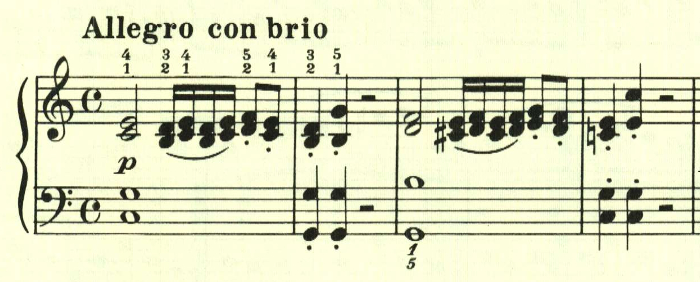
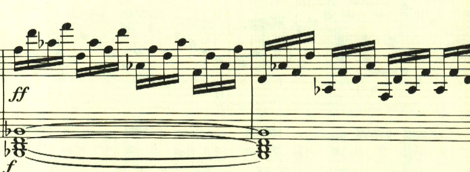

# ベートーヴェン ピアノソナタ第3番 第1楽章

<iframe height="175" width="100%" title="Media player" src="https://embed.music.apple.com/us/album/piano-sonata-no-3-in-c-major-op-2-no-3-i-allegro-con-brio/1264640017?i=1264640161&amp;itscg=30200&amp;itsct=music_box_player&amp;ls=1&amp;app=music&amp;mttnsubad=1264640161&amp;theme=auto" id="embedPlayer" style="border:0;border-radius:12px;width:100%;height:175px;max-width:660px" sandbox="allow-forms allow-popups allow-same-origin allow-scripts allow-top-navigation-by-user-activation" allow="autoplay *; encrypted-media *; clipboard-write"></iframe>

第3番は、和音、分散和音への執着が見られ、ベートーヴェンがこれまでと違った道へ進み出したことを伺わせる。1、2番で見られたような速いパッセージは無くなったものの、この出だしの3度はやっかいだ。

全曲を通じて分散和音が多用されている。

繰り返しの後、主題の展開が行われるかと思いきや、新しいテーマが現れる。

その後、ようやくニ長調に転調された主題が現われて展開されるが、長くは続かない。

この後も次々と新しいテーマが現われ、ベートーヴェンの意気込みが伝わってくる。和音やオクターブを強く弾く場面が多く、ベートーヴェンの特長が出てきている。

楽譜引用はヘンレ版から。
