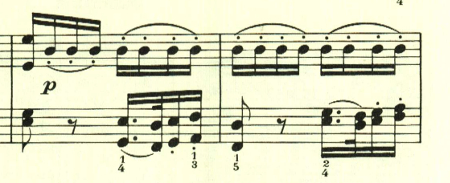

# ベートーヴェン ピアノソナタ第3番 第2楽章

<iframe height="175" width="100%" title="Media player" src="https://embed.music.apple.com/us/album/piano-sonata-no-3-in-c-major-op-2-no-3-ii-adagio/1264640017?i=1264640162&amp;itscg=30200&amp;itsct=music_box_player&amp;ls=1&amp;app=music&amp;mttnsubad=1264640162&amp;theme=auto" id="embedPlayer" style="border:0;border-radius:12px;width:100%;height:175px;max-width:660px" sandbox="allow-forms allow-popups allow-same-origin allow-scripts allow-top-navigation-by-user-activation" allow="autoplay *; encrypted-media *; clipboard-write"></iframe>

第1楽章が、様々なテーマを投入してきたのに対し、第2楽章は、2つの主題を交互に登場させつつ、少しずつ変化を入れるという新たな構成に挑戦している。最初の主題は、のどかな風景を思わせる。

次の主題は、短調となって左手でゆっくりと靄の中を歩むかのように奏でられる。

最後は左手で最初の主題が奏されて靜かに終わる。

楽譜引用はヘンレ版
