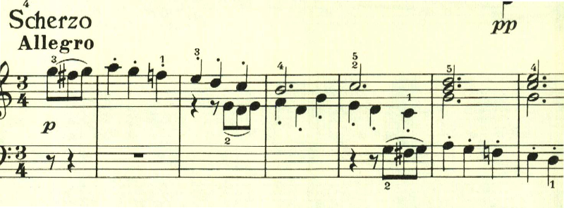
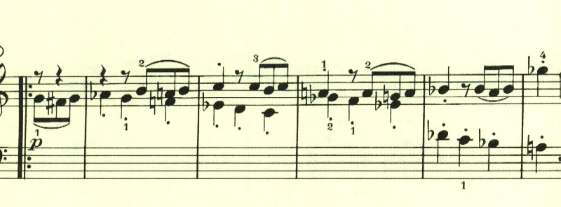
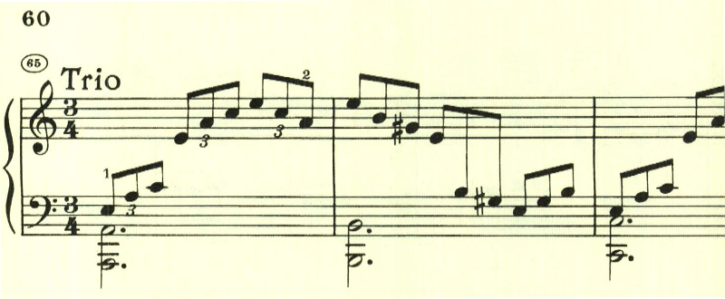
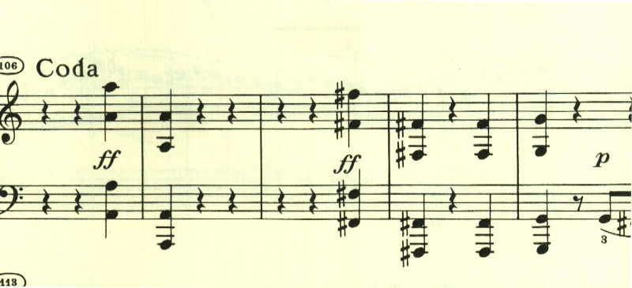

# ベートーヴェン ピアノ・ソナタ 第3番 第3楽章

<iframe height="175" width="100%" title="Media player" src="https://embed.music.apple.com/us/album/piano-sonata-no-3-in-c-major-op-2-no-3-iii-scherzo-allegro/1264640017?i=1264640163&amp;itscg=30200&amp;itsct=music_box_player&amp;ls=1&amp;app=music&amp;mttnsubad=1264640163&amp;theme=auto" id="embedPlayer" style="border:0;border-radius:12px;width:100%;height:175px;max-width:660px" sandbox="allow-forms allow-popups allow-same-origin allow-scripts allow-top-navigation-by-user-activation" allow="autoplay *; encrypted-media *; clipboard-write"></iframe>

第3番のソナタも4楽章構成になっており、第3楽章はスケルツォ。軽快なスタカートで始まる。

最初のテーマが変化を伴いながら展開されていく。

トリオは、短調となりアルペジオを主体としている。

ダカーポとなり最初のパートが繰り返された後にコーダとなって曲を終える。コーダでも最初のテーマが活用されている。

楽譜引用はヘンレ版
