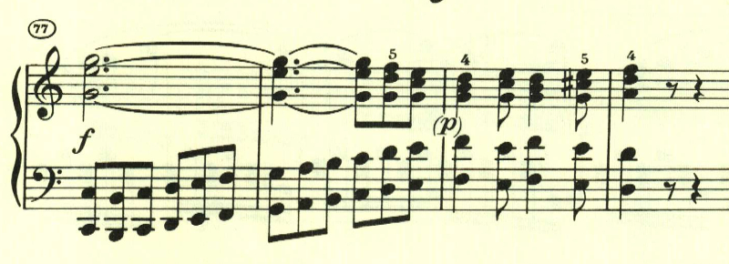

# ベートーヴェン ピアノ・ソナタ 第3番 第4楽章

<iframe height="175" width="100%" title="Media player" src="https://embed.music.apple.com/us/album/piano-sonata-no-3-in-c-major-op-2-no-3-iv-allegro-assai/1264640017?i=1264640164&amp;itscg=30200&amp;itsct=music_box_player&amp;ls=1&amp;app=music&amp;mttnsubad=1264640164&amp;theme=auto" id="embedPlayer" style="border:0;border-radius:12px;width:100%;height:175px;max-width:660px" sandbox="allow-forms allow-popups allow-same-origin allow-scripts allow-top-navigation-by-user-activation" allow="autoplay *; encrypted-media *; clipboard-write"></iframe>

第4楽章は、第1楽章と同様にロンド風な構造の中に、様々なテーマが散りばめられた作品。こちらも第1楽章と同様に、曲の出だしで和音のやっかいな進行を要求される。

続くテーマは、最初のテーマとは対照的なスラーのかかった滑らかなもの。

最初のテーマを繰り返した後に現れるテーマは前のものと似ているもので曲全体で展開される。

左手で最初のテーマが再現されるが、この時は和音でなくオクターブで奏され、変化を伴っている。

楽譜引用はヘンレ版
