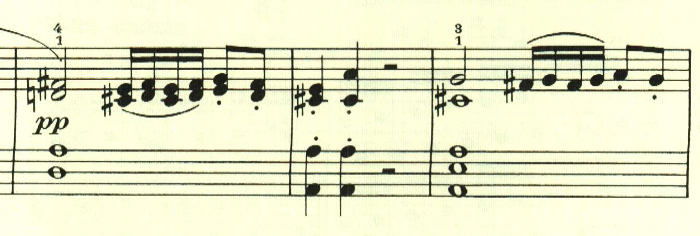
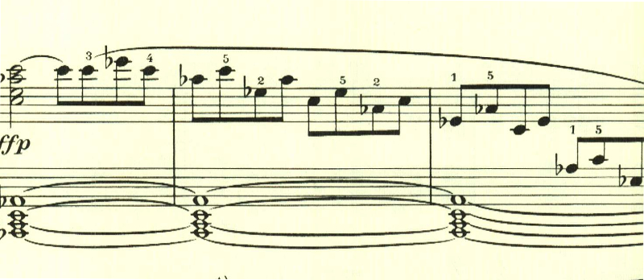
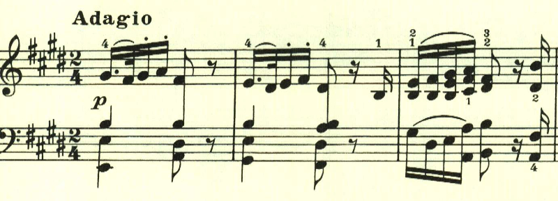
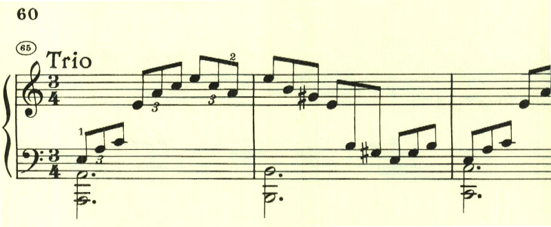

# ベートーヴェン ピアノソナタ第3番

## 第1楽章

<iframe height="175" width="100%" title="Media player" src="https://embed.music.apple.com/us/album/piano-sonata-no-3-in-c-major-op-2-no-3-i-allegro-con-brio/1264640017?i=1264640161&amp;itscg=30200&amp;itsct=music_box_player&amp;ls=1&amp;app=music&amp;mttnsubad=1264640161&amp;theme=auto" id="embedPlayer" style="border:0;border-radius:12px;width:100%;height:175px;max-width:660px" sandbox="allow-forms allow-popups allow-same-origin allow-scripts allow-top-navigation-by-user-activation" allow="autoplay *; encrypted-media *; clipboard-write"></iframe>

第3番は、和音、分散和音への執着が見られ、ベートーヴェンがこれまでと違った道へ進み出したことを伺わせる。1、2番で見られたような速いパッセージは無くなったものの、この出だしの3度はやっかいだ。

全曲を通じて分散和音が多用されている。

繰り返しの後、主題の展開が行われるかと思いきや、新しいテーマが現れる。

その後、ようやくニ長調に転調された主題が現われて展開されるが、長くは続かない。

この後も次々と新しいテーマが現われ、ベートーヴェンの意気込みが伝わってくる。和音やオクターブを強く弾く場面が多く、ベートーヴェンの特長が出てきている。

## 第2楽章

<iframe height="175" width="100%" title="Media player" src="https://embed.music.apple.com/us/album/piano-sonata-no-3-in-c-major-op-2-no-3-ii-adagio/1264640017?i=1264640162&amp;itscg=30200&amp;itsct=music_box_player&amp;ls=1&amp;app=music&amp;mttnsubad=1264640162&amp;theme=auto" id="embedPlayer" style="border:0;border-radius:12px;width:100%;height:175px;max-width:660px" sandbox="allow-forms allow-popups allow-same-origin allow-scripts allow-top-navigation-by-user-activation" allow="autoplay *; encrypted-media *; clipboard-write"></iframe>

第1楽章が、様々なテーマを投入してきたのに対し、第2楽章は、2つの主題を交互に登場させつつ、少しずつ変化を入れるという新たな構成に挑戦している。最初の主題は、のどかな風景を思わせる。

次の主題は、短調となって左手でゆっくりと靄の中を歩むかのように奏でられる。

最後は左手で最初の主題が奏されて靜かに終わる。

## 第3楽章

<iframe height="175" width="100%" title="Media player" src="https://embed.music.apple.com/us/album/piano-sonata-no-3-in-c-major-op-2-no-3-iii-scherzo-allegro/1264640017?i=1264640163&amp;itscg=30200&amp;itsct=music_box_player&amp;ls=1&amp;app=music&amp;mttnsubad=1264640163&amp;theme=auto" id="embedPlayer" style="border:0;border-radius:12px;width:100%;height:175px;max-width:660px" sandbox="allow-forms allow-popups allow-same-origin allow-scripts allow-top-navigation-by-user-activation" allow="autoplay *; encrypted-media *; clipboard-write"></iframe>

第3番のソナタも4楽章構成になっており、第3楽章はスケルツォ。軽快なスタカートで始まる。

最初のテーマが変化を伴いながら展開されていく。

トリオは、短調となりアルペジオを主体としている。

ダカーポとなり最初のパートが繰り返された後にコーダとなって曲を終える。コーダでも最初のテーマが活用されている。

# 第4楽章

<iframe height="175" width="100%" title="Media player" src="https://embed.music.apple.com/us/album/piano-sonata-no-3-in-c-major-op-2-no-3-iv-allegro-assai/1264640017?i=1264640164&amp;itscg=30200&amp;itsct=music_box_player&amp;ls=1&amp;app=music&amp;mttnsubad=1264640164&amp;theme=auto" id="embedPlayer" style="border:0;border-radius:12px;width:100%;height:175px;max-width:660px" sandbox="allow-forms allow-popups allow-same-origin allow-scripts allow-top-navigation-by-user-activation" allow="autoplay *; encrypted-media *; clipboard-write"></iframe>

第4楽章は、第1楽章と同様にロンド風な構造の中に、様々なテーマが散りばめられた作品。こちらも第1楽章と同様に、曲の出だしで和音のやっかいな進行を要求される。

続くテーマは、最初のテーマとは対照的なスラーのかかった滑らかなもの。

最初のテーマを繰り返した後に現れるテーマは前のものと似ているもので曲全体で展開される。

左手で最初のテーマが再現されるが、この時は和音でなくオクターブで奏され、変化を伴っている。

楽譜引用はヘンレ版
