# べートーヴェン ピアノ・ソナタ第4番 第1楽章

<iframe height="175" width="100%" title="Media player" src="https://embed.music.apple.com/us/album/piano-sonata-no-4-in-e-flat-major-op-7-i-allegro-molto-e-con-brio/1264936969?i=1264936980&amp;itscg=30200&amp;itsct=music_box_player&amp;ls=1&amp;app=music&amp;mttnsubad=1264936980&amp;theme=auto" id="embedPlayer" style="border:0;border-radius:12px;width:100%;height:175px;max-width:660px" sandbox="allow-forms allow-popups allow-same-origin allow-scripts allow-top-navigation-by-user-activation" allow="autoplay *; encrypted-media *; clipboard-write"></iframe>

第4番も様々なテーマを登場させて構成する造りになっている。それでも3番よりもまとまって感じるのは、1つ1つのテーマがシンプルであり、テーマ同士に似たものが多いためだろうか。様々なテーマが次々と現れるのでパレードを見ているようで楽しい。

最初のテーマは和音による進行で非常にシンプルで堂々としたもの。

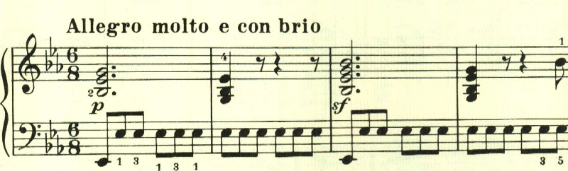

続くテーマは繊細で対照的。

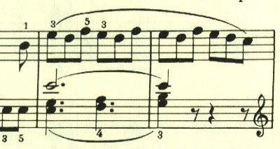

最初のテーマが変化を伴って現れる。

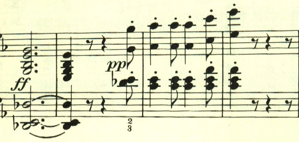

左手に新しいテーマが現れる。

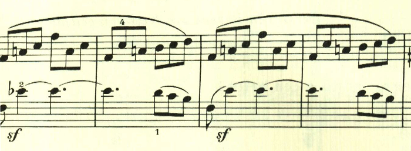

更に新しいテーマ。

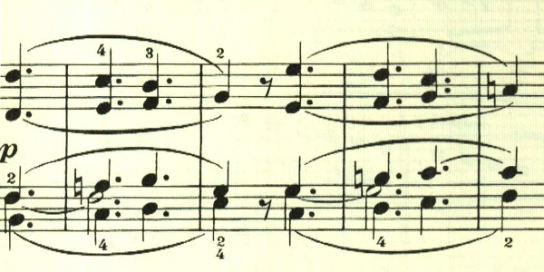

このテーマは曲全体で何度も変化を伴って使用されている。左手のパートは、1つ前のテーマに良く似ている。

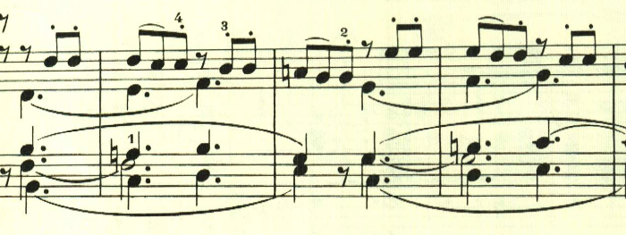

このテーマも1つ前のものに良く似ている。

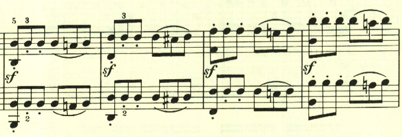

次々と新しいテーマが現れる。

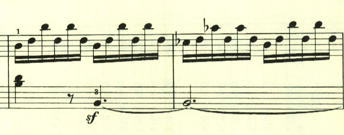

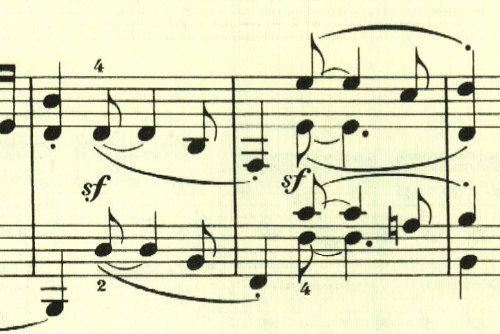

繰り返しの後に、最初のテーマの展開が短調で行われる。

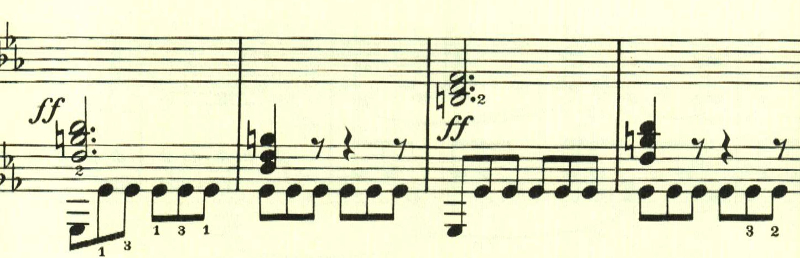

展開部は短かく、すぐに最初のテーマが再現される。

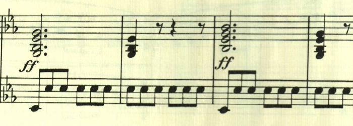

最後の部分で最初のテーマが変化を伴って再現され、終わりが近いことを感じさせる。

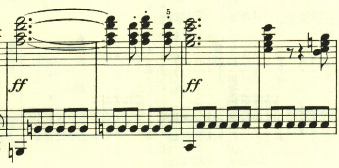

楽譜引用はヘンレ版
