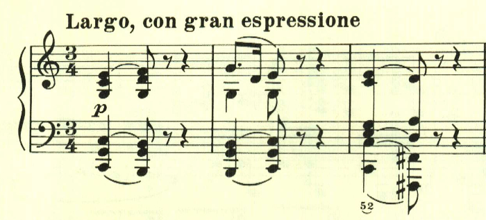
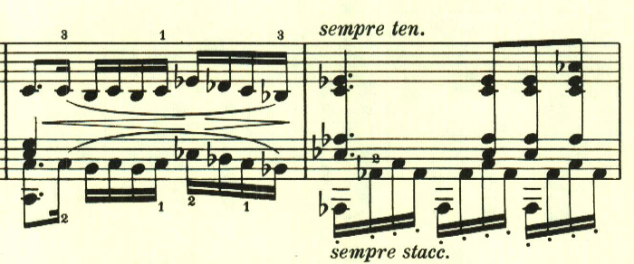
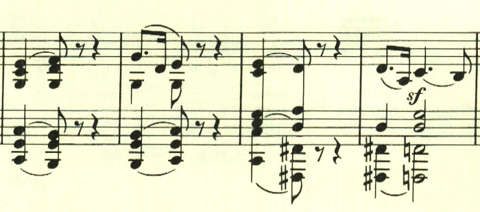
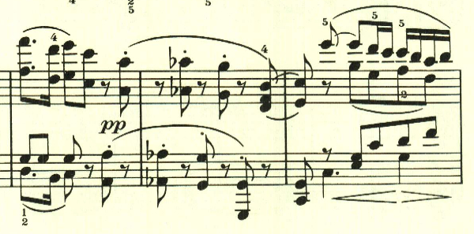

# ベートーヴェン ピアノ・ソナタ 第4番 第2楽章

<iframe height="175" width="100%" title="Media player" src="https://embed.music.apple.com/us/album/piano-sonata-no-4-in-e-flat-major-op-7-ii-largo-con/1264936969?i=1264936981&amp;itscg=30200&amp;itsct=music_box_player&amp;ls=1&amp;app=music&amp;mttnsubad=1264936981&amp;theme=auto" id="embedPlayer" style="border:0;border-radius:12px;width:100%;height:175px;max-width:660px" sandbox="allow-forms allow-popups allow-same-origin allow-scripts allow-top-navigation-by-user-activation" allow="autoplay *; encrypted-media *; clipboard-write"></iframe>

ベートーヴェンらしく、単純な音型が展開される緩徐楽章。

ここで新しいテーマが出てきて雰囲気が変わる。

最初のテーマが帰ってくる。

再度展開が行われた後に出てくるこの音型は、曲の終わりを感じさせる。

楽譜引用はヘンレ版。
