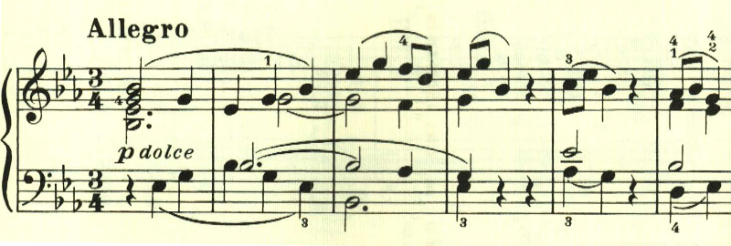
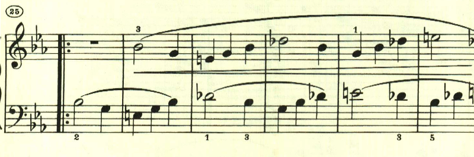
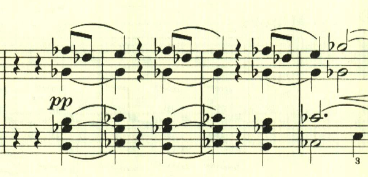
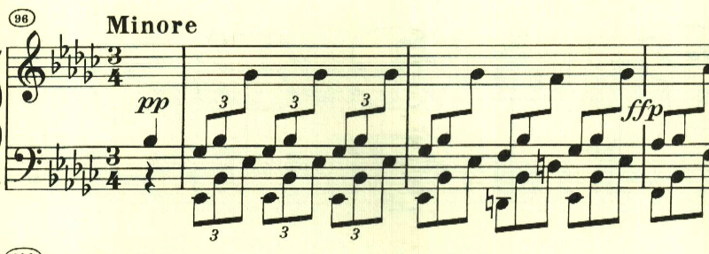

# ベートーヴェン ピアノ・ソナタ第4番 第3楽章

<iframe height="175" width="100%" title="Media player" src="https://embed.music.apple.com/us/album/piano-sonata-no-4-in-e-flat-major-op-7-iii-allegro/1264936969?i=1264936982&amp;itscg=30200&amp;itsct=music_box_player&amp;ls=1&amp;app=music&amp;mttnsubad=1264936982&amp;theme=auto" id="embedPlayer" style="border:0;border-radius:12px;width:100%;height:175px;max-width:660px" sandbox="allow-forms allow-popups allow-same-origin allow-scripts allow-top-navigation-by-user-activation" allow="autoplay *; encrypted-media *; clipboard-write"></iframe>

第4番も4楽章で構成されている。第3楽章はかわいらしい旋律で始まる。

最初の主題がカノン風に展開される。

最初のテーマの後半部分の反転型が何度も使われる。

中間部は激しい短調のパッセージ。

楽譜引用はヘンレ版
