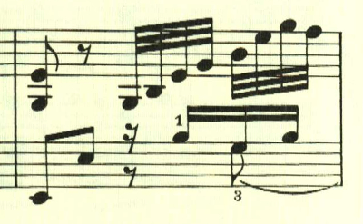
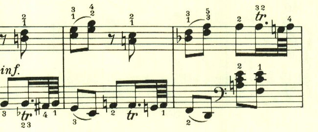
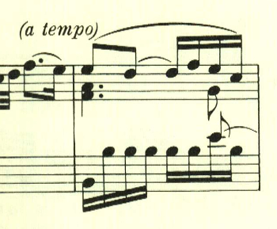
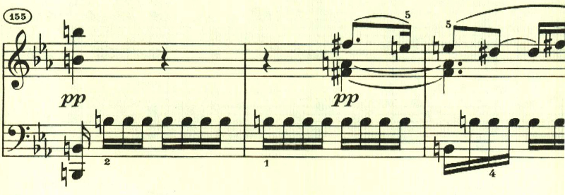
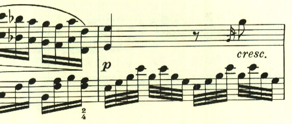

# ベートーヴェン ピアノ・ソナタ第4番 第4楽章

<iframe height="175" width="100%" title="Media player" src="https://embed.music.apple.com/us/album/piano-sonata-no-4-in-e-flat-major-op-7-iv-rondo-poco/1264936969?i=1264936983&amp;itscg=30200&amp;itsct=music_box_player&amp;ls=1&amp;app=music&amp;mttnsubad=1264936983&amp;theme=auto" id="embedPlayer" style="border:0;border-radius:12px;width:100%;height:175px;max-width:660px" sandbox="allow-forms allow-popups allow-same-origin allow-scripts allow-top-navigation-by-user-activation" allow="autoplay *; encrypted-media *; clipboard-write"></iframe>

第4楽章も、色々な旋律が次々と現れる曲。

次のテーマは、アルペジオ主体のもので曲を通して何度も使われる。

次のテーマは、小さな断片の繰り返し。

ここは経過句のようなトリル主体のテーマ。

中間部には、アルペジオを主体とした激しいパッセージが置かれている。

最初のテーマが再現される。

ここで不思議な転調をするが、すぐに元に戻って肩すかし。

さぁ、終わりだよという感じのテーマが現われて靜かに終わる。

楽譜引用はヘンレ版から。
