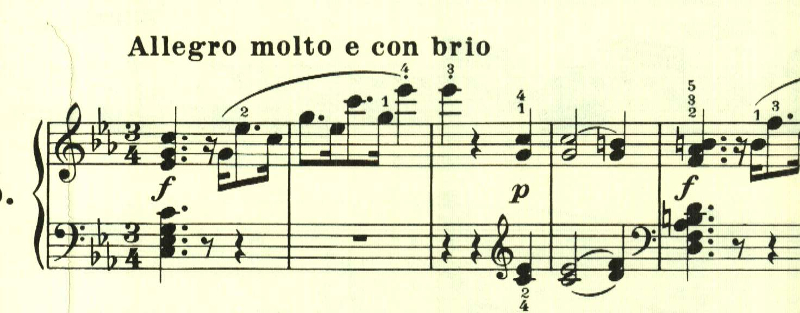

# ベートーヴェン ピアノ・ソナタ 第5番 第1楽章

<iframe height="175" width="100%" title="Media player" src="https://embed.music.apple.com/us/album/piano-sonata-no-5-in-c-minor-op-10-no-1-i-allegro-molto-e-con-brio/1264936969?i=1264936984&amp;itscg=30200&amp;itsct=music_box_player&amp;ls=1&amp;app=music&amp;mttnsubad=1264936984&amp;theme=auto" id="embedPlayer" style="border:0;border-radius:12px;width:100%;height:175px;max-width:660px" sandbox="allow-forms allow-popups allow-same-origin allow-scripts allow-top-navigation-by-user-activation" allow="autoplay *; encrypted-media *; clipboard-write"></iframe>

これまで様々な素材を出して大きな曲を構成してきたのが、第5番では一転ミニマリストとなる。曲は怒りのような、銃声のようなハ短調の激しいテーマで始まる。

対照的におだやかな長調のテーマとなり対比が見事。

そのまま流れるようなテーマとなる。

展開部は長調で始まり、これまでのテーマが展開される。

再現部も、目新しいテーマを追加されることはなく、これまでのテーマが繰り返し用いられるが、微妙に変化が加えられていて、飽きさせない工夫が感じられる。

