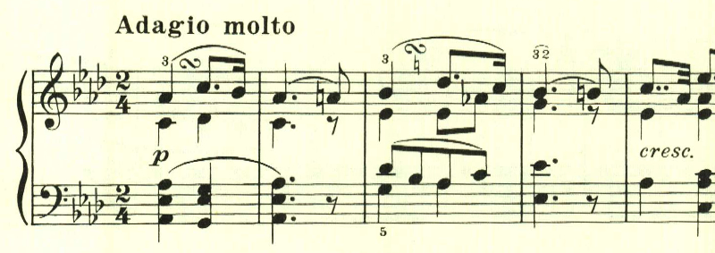
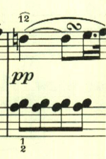
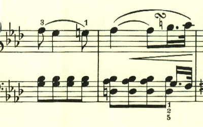
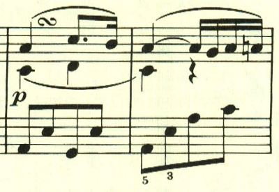
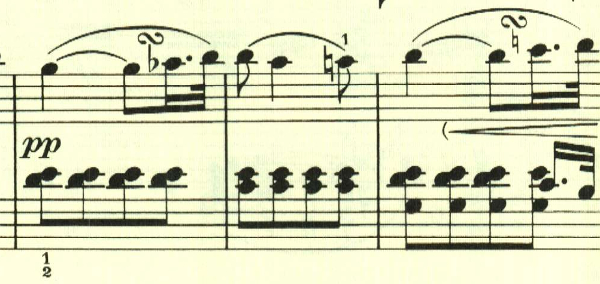

# ベートーヴェン ピアノソナタ 第5番 第2楽章

<iframe height="175" width="100%" title="Media player" src="https://embed.music.apple.com/us/album/piano-sonata-no-5-in-c-minor-op-10-no-1-ii-adagio-molto/1264936969?i=1264936985&amp;itscg=30200&amp;itsct=music_box_player&amp;ls=1&amp;app=music&amp;mttnsubad=1264936985&amp;theme=auto" id="embedPlayer" style="border:0;border-radius:12px;width:100%;height:175px;max-width:660px" sandbox="allow-forms allow-popups allow-same-origin allow-scripts allow-top-navigation-by-user-activation" allow="autoplay *; encrypted-media *; clipboard-write"></iframe>

ソナタ第5番は、それまでと異なり3楽章構成となり、その後定番となる、第2楽章に緩徐楽章を置く3楽章構成がここで試されている。定番通り第1楽章が短調なのに対して、第2楽章は長調となっている。

第2主題も長調で、第1主題と非常に似たものが使用されている。

第1主題が繰り返される。

第1主題は同一の調で繰り返されたが、第2主題は調を変えている。ただし長調のままで、曲全体で長調へのこだわりが見られる。

第1主題再度繰り返される。伴奏部分が曲の終わりが近いことを感じさせる。そのまま靜かに終わる。

楽譜引用はヘンレ版から。
