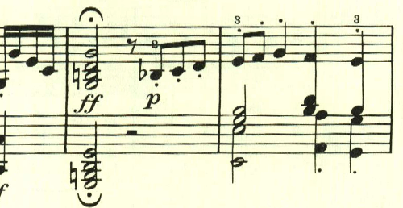

# ベートーヴェン ピアノ・ソナタ 第5番 第3楽章

<iframe height="175" width="100%" title="Media player" src="https://embed.music.apple.com/us/album/piano-sonata-no-5-in-c-minor-op-10-no-1-iii-finale-prestissimo/1264936969?i=1264936986&amp;itscg=30200&amp;itsct=music_box_player&amp;ls=1&amp;app=music&amp;mttnsubad=1264936986&amp;theme=auto" id="embedPlayer" style="border:0;border-radius:12px;width:100%;height:175px;max-width:660px" sandbox="allow-forms allow-popups allow-same-origin allow-scripts allow-top-navigation-by-user-activation" allow="autoplay *; encrypted-media *; clipboard-write"></iframe>

終楽章は、様々なダイナミックな変化が試されている印象的な傑作。リズム、速さの変化、音量の変化と全てが印象的な傑作。曲は最初はハ短調の不気味で靜かなテーマで始まる。

次第に音量を増して行き、左手の印象的なアクセントでクライマックスを迎える。

2つ目のテーマは対照的な変ホ長調だが、スタカート主体の雰囲気が残されている。

展開部。提示部と対照的に長調となる点は多くのソナタと同様だが、音型に変化が付けられており工夫が見られる。

展開部は非常に短かく、すぐに再現部となる。第1テーマが繰り返された後、第2テーマはト長調となる。このように第2テーマの調を最初と変えるやり方は、第2楽章でも見られた。

最後は、第1テーマを繰り返しなが消え入るように終わる。

楽譜引用はヘンレ版。
