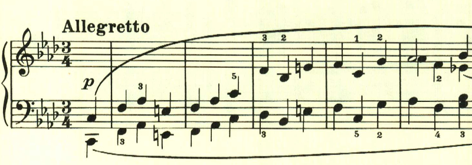
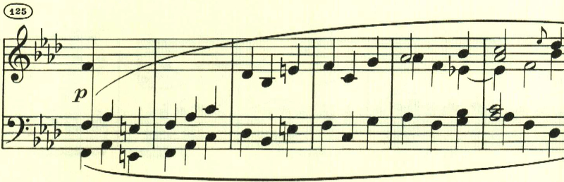

# ベートーヴェン ピアノ・ソナタ 第6番 第2楽章

<iframe height="175" width="100%" title="Media player" src="https://embed.music.apple.com/us/album/piano-sonata-no-6-in-f-major-op-10-no-2-ii-menuetto-allegretto/1264936969?i=1264936988&amp;itscg=30200&amp;itsct=music_box_player&amp;ls=1&amp;app=music&amp;mttnsubad=1264936988&amp;theme=auto" id="embedPlayer" style="border:0;border-radius:12px;width:100%;height:175px;max-width:660px" sandbox="allow-forms allow-popups allow-same-origin allow-scripts allow-top-navigation-by-user-activation" allow="autoplay *; encrypted-media *; clipboard-write"></iframe>

第2楽章は、なにやら忙しい日常、あるいは大きなイベントを控えた緊張を思わせるような旋律で始まる。ここまで、第2楽章は長調のゆっくりしたものばかりだったが、第6番で初めて短調で、しかもアレグレットという速いものが試されている。

このリズムと独特のアクセントも何かに追い立てられているような感じ。

中間部はゆったりとした長調となり、その対比が見事。ただやはり何かに追い立てらているかのように、落ち着かない。

最初のテーマが繰り返されて終わる。

楽譜引用は、ヘンレ版
