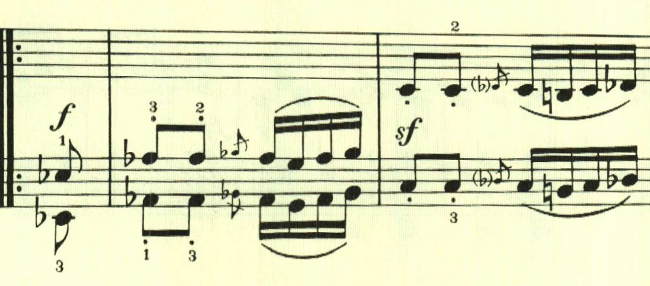

# ベートーヴェン ピアノ・ソナタ 第6番 第3楽章

<iframe height="175" width="100%" title="Media player" src="https://embed.music.apple.com/us/album/piano-sonata-no-6-in-f-major-op-10-no-2-iii-presto/1264936969?i=1264936989&amp;itscg=30200&amp;itsct=music_box_player&amp;ls=1&amp;app=music&amp;mttnsubad=1264936989&amp;theme=auto" id="embedPlayer" style="border:0;border-radius:12px;width:100%;height:175px;max-width:660px" sandbox="allow-forms allow-popups allow-same-origin allow-scripts allow-top-navigation-by-user-activation" allow="autoplay *; encrypted-media *; clipboard-write"></iframe>

第3楽章は、1つの主題をひたすらに活用して行く構成にチャレンジしている。曲全体を通して、冒頭の主題に含まれる2つの音型が何度も活用されていく。

曲は大きは2つに分かれていて、両方とも繰り返しの指定がある。後半部から調の変化があり、主題の展開が始まることを期待させる。

ここからは短調も織り交ぜられていき、めまぐるしい速さの中で終わる。

楽譜引用はヘンレ版
