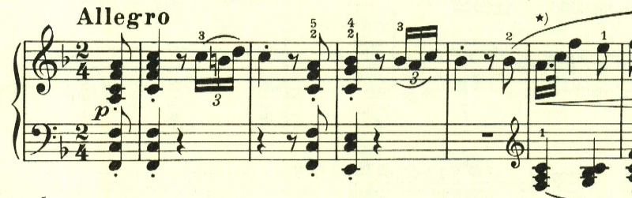
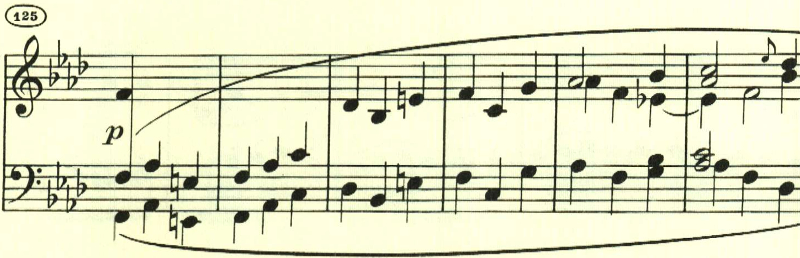
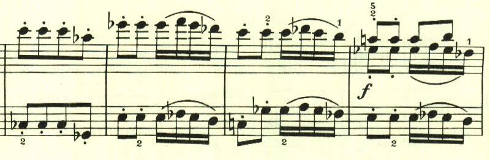

# ベートーヴェン ピアノソナタ第6番

## 第1楽章

<iframe height="175" width="100%" title="Media player" src="https://embed.music.apple.com/us/album/piano-sonata-no-6-in-f-major-op-10-no-2-i-allegro/1264936969?i=1264936987&amp;itscg=30200&amp;itsct=music_box_player&amp;ls=1&amp;app=music&amp;mttnsubad=1264936987&amp;theme=auto" id="embedPlayer" style="border:0;border-radius:12px;width:100%;height:175px;max-width:660px" sandbox="allow-forms allow-popups allow-same-origin allow-scripts allow-top-navigation-by-user-activation" allow="autoplay *; encrypted-media *; clipboard-write"></iframe>

第6番は、軽やかな和音で始まる。

曲は3つに分かれるが、第一部は一貫して長調で構成されている。その分、リズムの変化が印象深い。

この一見、経過句のような音型が後で重要な役割を果たす(1)。

第二部は、短調となる。通常であれば第一部の最初のテーマの展開から開始されるところだが、第一部の(1)の部分が展開される。

ここは新しいテーマのようにも、(1)の反転型のようにも見える。

第三部は、第一部がニ長調で繰り返されて終わる。

## 第2楽章

<iframe height="175" width="100%" title="Media player" src="https://embed.music.apple.com/us/album/piano-sonata-no-6-in-f-major-op-10-no-2-ii-menuetto-allegretto/1264936969?i=1264936988&amp;itscg=30200&amp;itsct=music_box_player&amp;ls=1&amp;app=music&amp;mttnsubad=1264936988&amp;theme=auto" id="embedPlayer" style="border:0;border-radius:12px;width:100%;height:175px;max-width:660px" sandbox="allow-forms allow-popups allow-same-origin allow-scripts allow-top-navigation-by-user-activation" allow="autoplay *; encrypted-media *; clipboard-write"></iframe>

第2楽章は、なにやら忙しい日常、あるいは大きなイベントを控えた緊張を思わせるような旋律で始まる。ここまで、第2楽章は長調のゆっくりしたものばかりだったが、第6番で初めて短調で、しかもアレグレットという速いものが試されている。

このリズムと独特のアクセントも何かに追い立てられているような感じ。

中間部はゆったりとした長調となり、その対比が見事。ただやはり何かに追い立てらているかのように、落ち着かない。

最初のテーマが繰り返されて終わる。

## 第3楽章

<iframe height="175" width="100%" title="Media player" src="https://embed.music.apple.com/us/album/piano-sonata-no-6-in-f-major-op-10-no-2-iii-presto/1264936969?i=1264936989&amp;itscg=30200&amp;itsct=music_box_player&amp;ls=1&amp;app=music&amp;mttnsubad=1264936989&amp;theme=auto" id="embedPlayer" style="border:0;border-radius:12px;width:100%;height:175px;max-width:660px" sandbox="allow-forms allow-popups allow-same-origin allow-scripts allow-top-navigation-by-user-activation" allow="autoplay *; encrypted-media *; clipboard-write"></iframe>

第3楽章は、1つの主題をひたすらに活用して行く構成にチャレンジしている。曲全体を通して、冒頭の主題に含まれる2つの音型が何度も活用されていく。

曲は大きは2つに分かれていて、両方とも繰り返しの指定がある。後半部から調の変化があり、主題の展開が始まることを期待させる。

ここからは短調も織り交ぜられていき、めまぐるしい速さの中で終わる。

楽譜引用はヘンレ版
