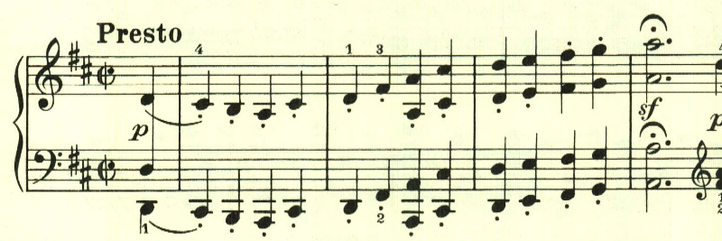
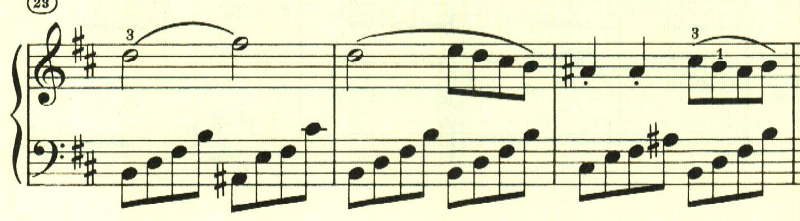
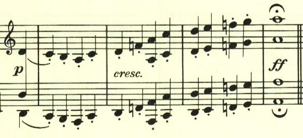
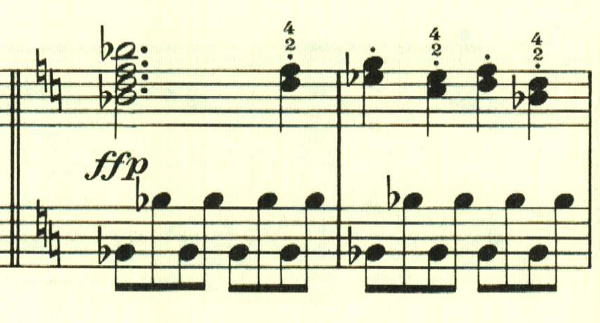

# ベートーヴェン ピアノソナタ 第7番 第1楽章

<iframe height="175" width="100%" title="Media player" src="https://embed.music.apple.com/us/album/piano-sonata-no-7-in-d-major-op-10-no-3-i-presto/1268209323?i=1268209324&amp;itscg=30200&amp;itsct=music_box_player&amp;ls=1&amp;app=music&amp;mttnsubad=1268209324&amp;theme=auto" id="embedPlayer" style="border:0;border-radius:12px;width:100%;height:175px;max-width:660px" sandbox="allow-forms allow-popups allow-same-origin allow-scripts allow-top-navigation-by-user-activation" allow="autoplay *; encrypted-media *; clipboard-write"></iframe>

5番、6番で最小構成にチャレンジしていたと思ったら、一転7番では拡大傾向になる。

第3、4番では、様々なテーマが出てくる形態だった。第7番も基本そうなのだが、どのテーマも最初の音階的な進行がベースになっているものが多く、単に前の拡大傾向に戻ったというわけではない。

展開部は、最初のテーマが短調で現われる。

テーマの展開というよりは、やはり新たな音階的進行がふんだんに使用される。

再現部となり、最初のテーマから繰り返される。

最後まで元気いっぱいで、はずむように曲を終わる。

楽譜引用はヘンレ版
