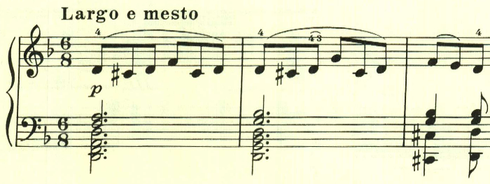
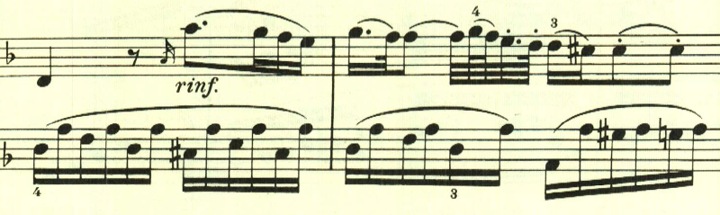
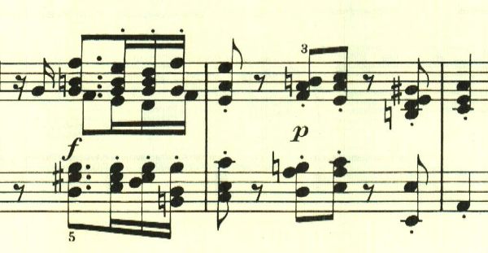
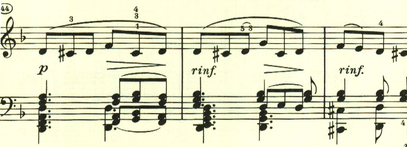
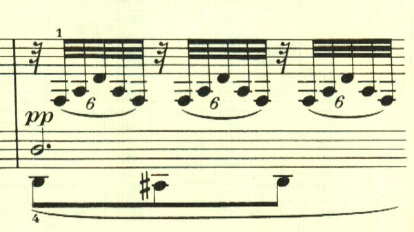
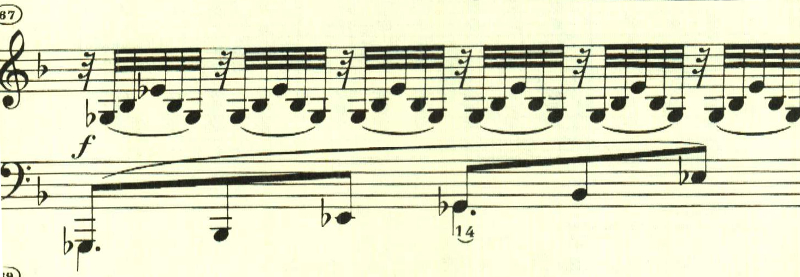

# ベートーヴェン ピアノ・ソナタ第7番 第2楽章

<iframe height="175" width="100%" title="Media player" src="https://embed.music.apple.com/us/album/piano-sonata-no-7-in-d-major-op-10-no-3-ii-largo-e-mesto/1268209323?i=1268209325&amp;itscg=30200&amp;itsct=music_box_player&amp;ls=1&amp;app=music&amp;mttnsubad=1268209325&amp;theme=auto" id="embedPlayer" style="border:0;border-radius:12px;width:100%;height:175px;max-width:660px" sandbox="allow-forms allow-popups allow-same-origin allow-scripts allow-top-navigation-by-user-activation" allow="autoplay *; encrypted-media *; clipboard-write"></iframe>

宗教音楽のような荘厳な楽章。

次のテーマも重々しい。

ここの特徴的なスタカートは後で何度も利用される。

幻想的な中間部は長調となり、暖かな水の中をただようかのようだ。

突如激しい雷のようなテーマが奏され、それに受け答えるようなテーマが続く。このような厳粛な雰囲気も宗教曲を思わせる。

最初のテーマが再現される。

左手に最初のテーマが現れて、

どんどんと変化していく様は見事だ。

楽譜引用はヘンレ版
