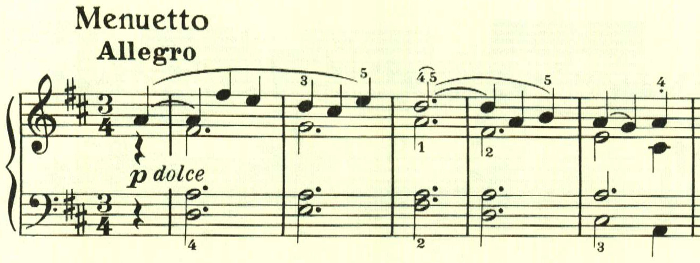
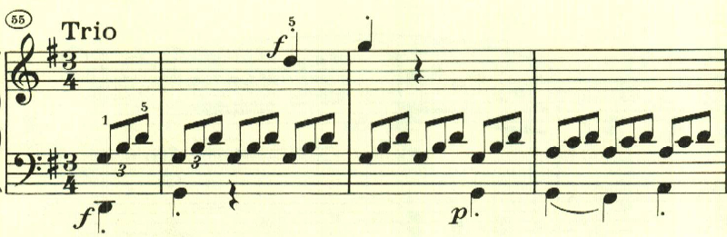

# ベートーヴェン ピアノソナタ 第7番 第3楽章

<iframe height="175" width="100%" title="Media player" src="https://embed.music.apple.com/us/album/piano-sonata-no-7-in-d-major-op-10-no-3-iii-menuetto-allegro/1268209323?i=1268209326&amp;itscg=30200&amp;itsct=music_box_player&amp;ls=1&amp;app=music&amp;mttnsubad=1268209326&amp;theme=auto" id="embedPlayer" style="border:0;border-radius:12px;width:100%;height:175px;max-width:660px" sandbox="allow-forms allow-popups allow-same-origin allow-scripts allow-top-navigation-by-user-activation" allow="autoplay *; encrypted-media *; clipboard-write"></iframe>

一時3楽章構成になっていたが、第7番は、4楽章構成に戻っており、第3楽章は、なんともかわいらしいテーマのメヌエット。楽章全体を通じて明い雰囲気につつまれる。

最初のテーマの変化したものが左手で奏され、

クライマックスに逹っする。

トリオも長調で、テーマの雰囲気も似ている。

楽譜引用はヘンレ版から。
