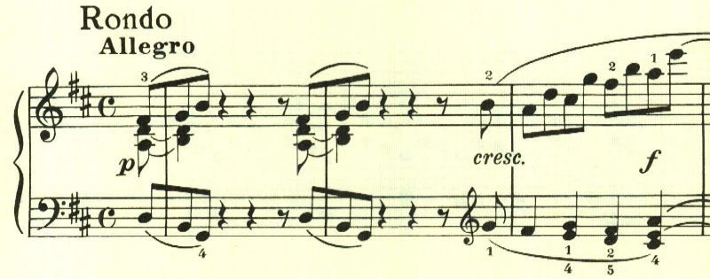
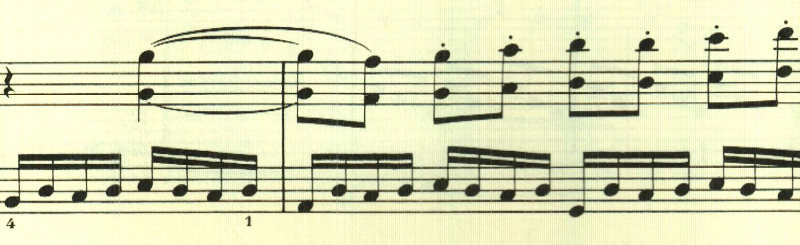
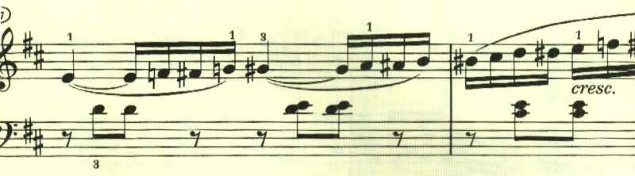
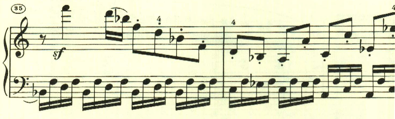
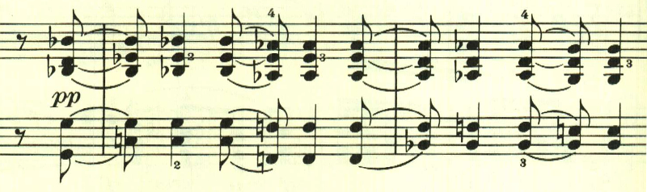

# ベートーヴェン ピアノソナタ 第7番 第4楽章

<iframe height="175" width="100%" title="Media player" src="https://embed.music.apple.com/us/album/piano-sonata-no-7-in-d-major-op-10-no-3-iv-rondo-allegro/1268209323?i=1268209327&amp;itscg=30200&amp;itsct=music_box_player&amp;ls=1&amp;app=music&amp;mttnsubad=1268209327&amp;theme=auto" id="embedPlayer" style="border:0;border-radius:12px;width:100%;height:175px;max-width:660px" sandbox="allow-forms allow-popups allow-same-origin allow-scripts allow-top-navigation-by-user-activation" allow="autoplay *; encrypted-media *; clipboard-write"></iframe>

第4楽章は、ロンドだが全般にメロディらしいメロディが無く即興的だ。最初のテーマは曲全体を通して繰り返して用いられる。

次のテーマも音階をベースとして捉えどころがない。

次は半音階。

最初のテーマが帰ってきた後のこのテーマも簡素なものだ。

最後は、なかば唐突に終わりを告げる和音が現れて靜かに終わる。

