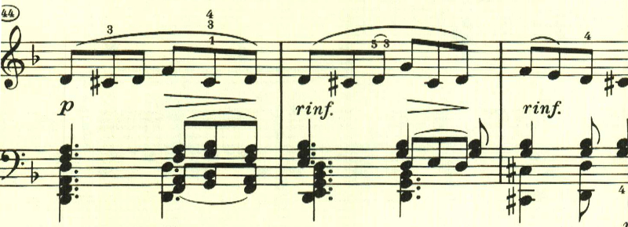
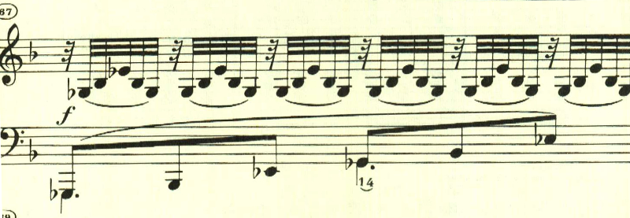
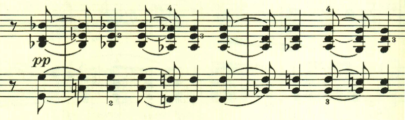

# ベートーヴェン ピアノソナタ 第7番

## 第1楽章

<iframe height="175" width="100%" title="Media player" src="https://embed.music.apple.com/us/album/piano-sonata-no-7-in-d-major-op-10-no-3-i-presto/1268209323?i=1268209324&amp;itscg=30200&amp;itsct=music_box_player&amp;ls=1&amp;app=music&amp;mttnsubad=1268209324&amp;theme=auto" id="embedPlayer" style="border:0;border-radius:12px;width:100%;height:175px;max-width:660px" sandbox="allow-forms allow-popups allow-same-origin allow-scripts allow-top-navigation-by-user-activation" allow="autoplay *; encrypted-media *; clipboard-write"></iframe>

5番、6番で最小構成にチャレンジしていたと思ったら、一転7番では拡大傾向になる。

第3、4番では、様々なテーマが出てくる形態だった。第7番も基本そうなのだが、どのテーマも最初の音階的な進行がベースになっているものが多く、単に前の拡大傾向に戻ったというわけではない。

展開部は、最初のテーマが短調で現われる。

テーマの展開というよりは、やはり新たな音階的進行がふんだんに使用される。

再現部となり、最初のテーマから繰り返される。

最後まで元気いっぱいで、はずむように曲を終わる。

## 第2楽章

<iframe height="175" width="100%" title="Media player" src="https://embed.music.apple.com/us/album/piano-sonata-no-7-in-d-major-op-10-no-3-ii-largo-e-mesto/1268209323?i=1268209325&amp;itscg=30200&amp;itsct=music_box_player&amp;ls=1&amp;app=music&amp;mttnsubad=1268209325&amp;theme=auto" id="embedPlayer" style="border:0;border-radius:12px;width:100%;height:175px;max-width:660px" sandbox="allow-forms allow-popups allow-same-origin allow-scripts allow-top-navigation-by-user-activation" allow="autoplay *; encrypted-media *; clipboard-write"></iframe>

宗教音楽のような荘厳な楽章。

次のテーマも重々しい。

ここの特徴的なスタカートは後で何度も利用される。

幻想的な中間部は長調となり、暖かな水の中をただようかのようだ。

突如激しい雷のようなテーマが奏され、それに受け答えるようなテーマが続く。このような厳粛な雰囲気も宗教曲を思わせる。

最初のテーマが再現される。

左手に最初のテーマが現れて、

どんどんと変化していく様は見事だ。

## 第3楽章

<iframe height="175" width="100%" title="Media player" src="https://embed.music.apple.com/us/album/piano-sonata-no-7-in-d-major-op-10-no-3-iii-menuetto-allegro/1268209323?i=1268209326&amp;itscg=30200&amp;itsct=music_box_player&amp;ls=1&amp;app=music&amp;mttnsubad=1268209326&amp;theme=auto" id="embedPlayer" style="border:0;border-radius:12px;width:100%;height:175px;max-width:660px" sandbox="allow-forms allow-popups allow-same-origin allow-scripts allow-top-navigation-by-user-activation" allow="autoplay *; encrypted-media *; clipboard-write"></iframe>

一時3楽章構成になっていたが、第7番は、4楽章構成に戻っており、第3楽章は、なんともかわいらしいテーマのメヌエット。楽章全体を通じて明い雰囲気につつまれる。

最初のテーマの変化したものが左手で奏され、

クライマックスに逹っする。

トリオも長調で、テーマの雰囲気も似ている。

## 第4楽章

<iframe height="175" width="100%" title="Media player" src="https://embed.music.apple.com/us/album/piano-sonata-no-7-in-d-major-op-10-no-3-iv-rondo-allegro/1268209323?i=1268209327&amp;itscg=30200&amp;itsct=music_box_player&amp;ls=1&amp;app=music&amp;mttnsubad=1268209327&amp;theme=auto" id="embedPlayer" style="border:0;border-radius:12px;width:100%;height:175px;max-width:660px" sandbox="allow-forms allow-popups allow-same-origin allow-scripts allow-top-navigation-by-user-activation" allow="autoplay *; encrypted-media *; clipboard-write"></iframe>

第4楽章は、ロンドだが全般にメロディらしいメロディが無く即興的だ。最初のテーマは曲全体を通して繰り返して用いられる。

次のテーマも音階をベースとして捉えどころがない。

次は半音階。

最初のテーマが帰ってきた後のこのテーマも簡素なものだ。

最後は、なかば唐突に終わりを告げる和音が現れて靜かに終わる。

楽譜引用はヘンレ版
