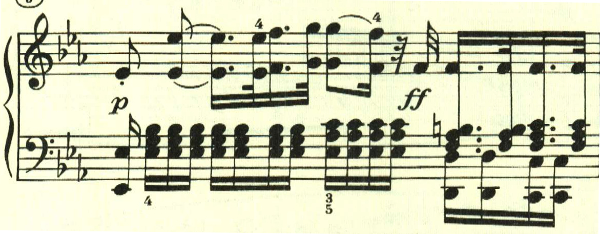
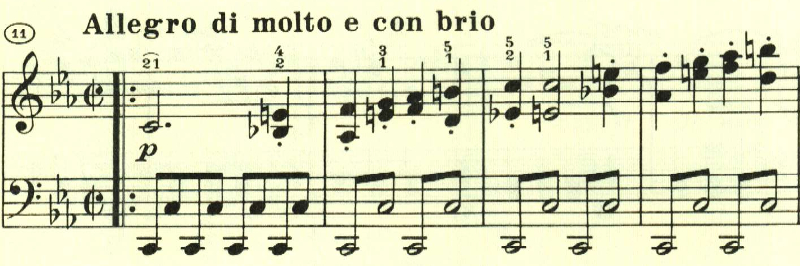
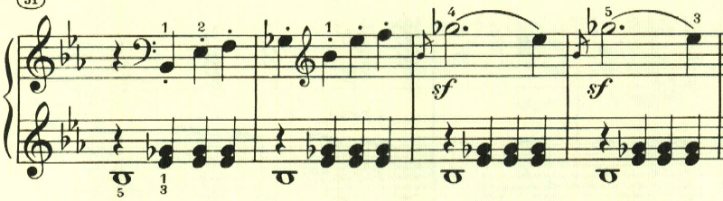
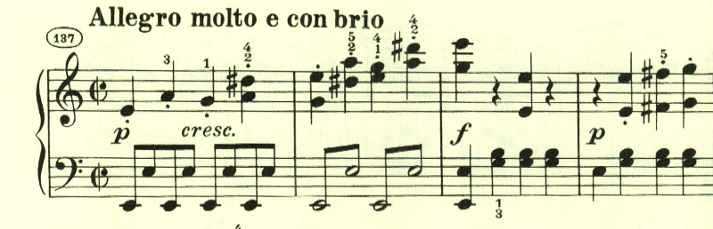
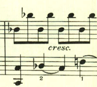
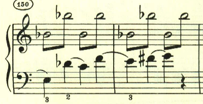
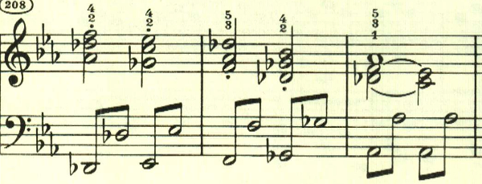
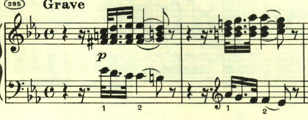

# ベートーヴェン ピアノソナタ 第8番「悲愴」第1楽章

<iframe height="175" width="100%" title="Media player" src="https://embed.music.apple.com/us/album/piano-sonata-no-8-in-c-minor-op-13-pathetique-i-grave/937943891?i=937943917&amp;itscg=30200&amp;itsct=music_box_player&amp;ls=1&amp;app=music&amp;mttnsubad=937943917&amp;theme=auto" id="embedPlayer" style="border:0;border-radius:12px;width:100%;height:175px;max-width:660px" sandbox="allow-forms allow-popups allow-same-origin allow-scripts allow-top-navigation-by-user-activation" allow="autoplay *; encrypted-media *; clipboard-write"></iframe>

有名な悲愴ソナタ。7番で4楽章制に回帰していたが、8番では3楽章制に戻っている。曲はGraveの序奏で始まる。この序奏は単なる序奏に留まらず曲全体で使われる。

序奏内でもテーマの展開は始まっている。長調の出だしと激しい短調の組み合わせは、葛藤を思わせる。

序奏が終わり、左手のトレモロの上に、最初のテーマが現れる。ここはpで音量を抑えていることが絶大な効果を上げている。

2つ目のテーマも、前半後半に分かれており、やはり何か葛藤を思わせる。

繰り返しの後、展開部に入る前に序奏が再度現れる。

展開部が始まり最初のテーマが展開される。

左手で不気味な音型が繰り返される。

ここでは最初の主題の後半部分が展開される。

再現部を経て、最後にもう一度序奏が現れた後に、最初のテーマが奏されて劇的に終わる。

楽譜引用はヘンレ版から
