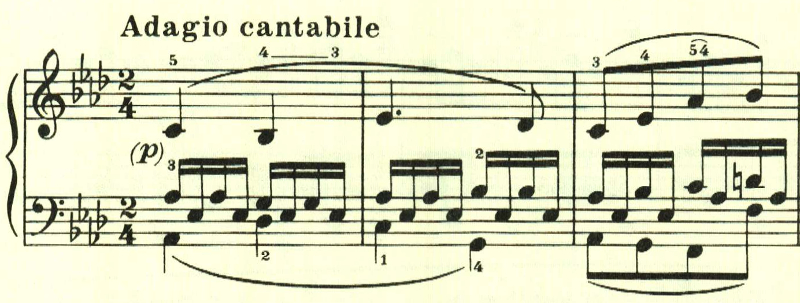
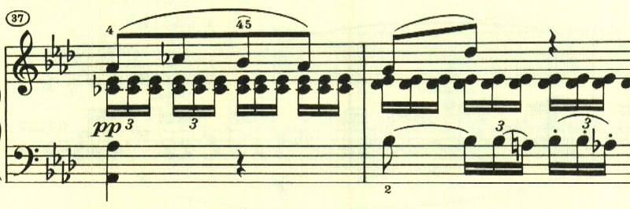
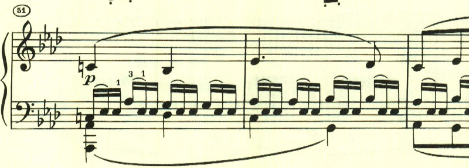
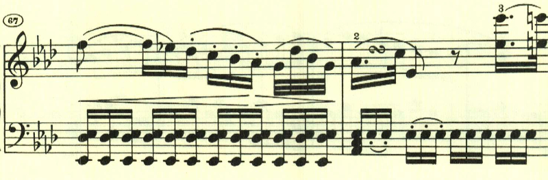

# ベートーヴェン ピアノ・ソナタ 第8番「悲愴」第2楽章

<iframe height="175" width="100%" title="Media player" src="https://embed.music.apple.com/us/album/piano-sonata-no-8-in-c-minor-op-13-pathetique-ii-adagio/937943891?i=937943918&amp;itscg=30200&amp;itsct=music_box_player&amp;ls=1&amp;app=music&amp;mttnsubad=937943918&amp;theme=auto" id="embedPlayer" style="border:0;border-radius:12px;width:100%;height:175px;max-width:660px" sandbox="allow-forms allow-popups allow-same-origin allow-scripts allow-top-navigation-by-user-activation" allow="autoplay *; encrypted-media *; clipboard-write"></iframe>

第2楽章は、暖かな春の日差しを思わせるような優しい旋律を持ちいたロンド。ロンド形式は、これまでは速い楽章で用いられることが多かったので、これも新たな試みの1つなのだろう。

短調となるが、深刻な感じとはならずに引き続きのどかな雰囲気が続く。

最初のテーマが伴奏に少しアレンジが入って繰り返される。

再度短調となる。ここは次第に激しさを増していくが、深刻な感じはなく、通り雨が通り過ぎていったかのよう。

再度、最初のテーマ。やはり伴奏にアレンジが入っている。

経過句のような短かなパッセージが入って靜かに終わる。

楽譜引用はヘンレ版
