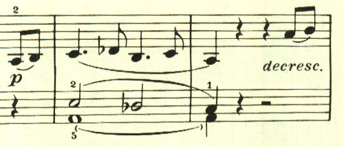

# ベートーヴェン ピアノ・ソナタ 第8番「悲愴」第3楽章

<iframe height="175" width="100%" title="Media player" src="https://embed.music.apple.com/us/album/piano-sonata-no-8-in-c-minor-op-13-pathetique-iii-rondo/937943891?i=937943919&amp;itscg=30200&amp;itsct=music_box_player&amp;ls=1&amp;app=music&amp;mttnsubad=937943919&amp;theme=auto" id="embedPlayer" style="border:0;border-radius:12px;width:100%;height:175px;max-width:660px" sandbox="allow-forms allow-popups allow-same-origin allow-scripts allow-top-navigation-by-user-activation" allow="autoplay *; encrypted-media *; clipboard-write"></iframe>

第3楽章はロンド。初期の頃に何度も試みられていた様々なテーマを出現させる構成が結実している。この曲はまた緩急を効果的に使うことに成功している。

曲は何かに追い立てられるような旋律で始まる。

スケール主体の最初の主題と異なり、アルペジオ主体の主題。

再びスケール主体のものが現れる。

対照的なゆったりとした和音で構成される長調となる。

そしてスケール主体な印象的なクライマックス。

ここも対照的なゆったりとした雰囲気となる。

ここは、最初のテーマの一部が展開される。

最後に、曲の終わりを感じさせるテーマが2つ現れて展開される

最後の最後にゆっくりとしたテーマが現れる印象的に終わる。

楽譜引用はヘンレ版
