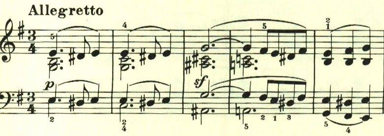
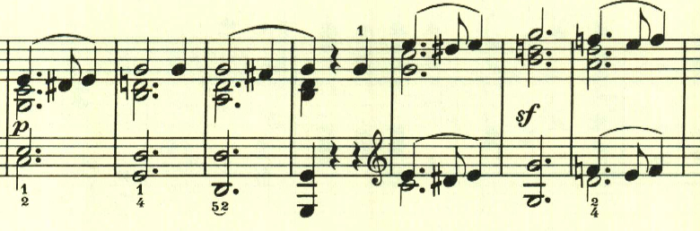
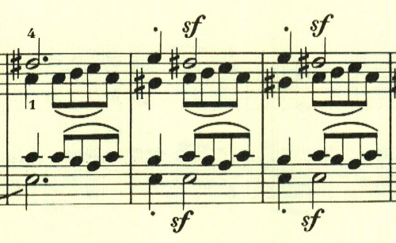
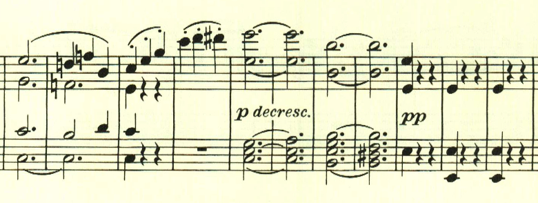

# ベートーヴェン ピアノ・ソナタ 第9番 第2楽章

<iframe height="175" width="100%" title="Media player" src="https://embed.music.apple.com/us/album/piano-sonata-no-9-in-e-major-op-14-no-1-ii-allegretto/1268209323?i=1268209329&amp;itscg=30200&amp;itsct=music_box_player&amp;ls=1&amp;app=music&amp;mttnsubad=1268209329&amp;theme=auto" id="embedPlayer" style="border:0;border-radius:12px;width:100%;height:175px;max-width:660px" sandbox="allow-forms allow-popups allow-same-origin allow-scripts allow-top-navigation-by-user-activation" allow="autoplay *; encrypted-media *; clipboard-write"></iframe>

第2楽章は民謡のようなテーマを用いた複合三部形式。最初の主題は物憂げな、あるいは何やら靄のかかったような、すっきりとしない雰囲気。

そのまま最初のテーマが展開される。

ここは、最初のテーマの一部の反転型だろうか。

中間部は暖かな、安堵を思わせるテーマ。しかしやはり何か霞がかかったような、夢の中のような、ぼやっとした風景を感じさせる。実は、ここで既に幻想風ソナタの萌芽が生まれていたのかもしれない。

Codaは中間部のテーマが繰り返されて、霞の中に消えていくように靜かに終わる。

楽譜引用はヘンレ版
