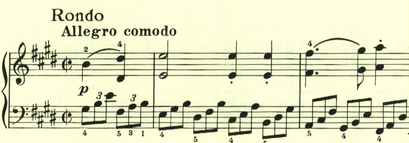

# ベートーヴェン ピアノ・ソナタ第9番 第3楽章

<iframe height="175" width="100%" title="Media player" src="https://embed.music.apple.com/us/album/piano-sonata-no-9-in-e-major-op-14-no-1-iii-rondo-allegro-comodo/1268209323?i=1268209330&amp;itscg=30200&amp;itsct=music_box_player&amp;ls=1&amp;app=music&amp;mttnsubad=1268209330&amp;theme=auto" id="embedPlayer" style="border:0;border-radius:12px;width:100%;height:175px;max-width:660px" sandbox="allow-forms allow-popups allow-same-origin allow-scripts allow-top-navigation-by-user-activation" allow="autoplay *; encrypted-media *; clipboard-write"></iframe>

即興的なロンド。単純なテーマが繰り返し用いられる。

雰囲気が変わってゆっくりとしたテーマが現れる。

  
  

ロンドとなっているが、多分にソナタ的で展開部は、このテーマが主に展開される。

再現部の最後に、最初のテーマが変化を伴って現れる。

楽譜引用はヘンレ版から。
