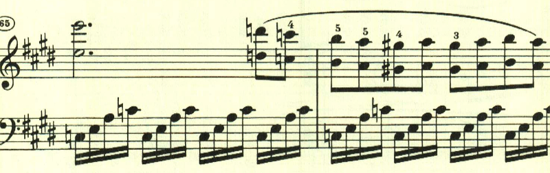
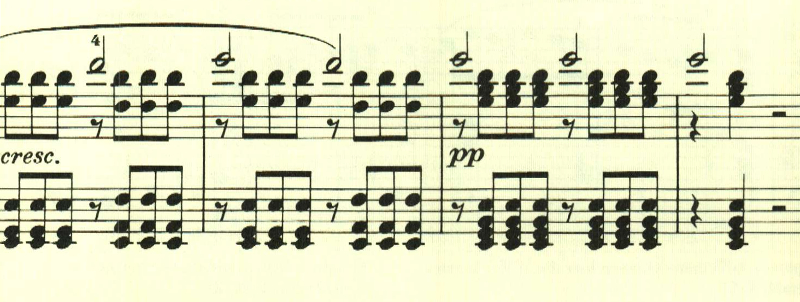
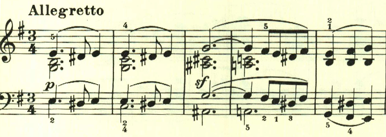
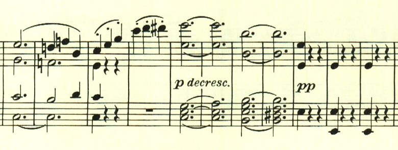

# ベートーヴェン ピアノ・ソナタ第9番

## 第1楽章

<iframe height="175" width="100%" title="Media player" src="https://embed.music.apple.com/us/album/piano-sonata-no-9-in-e-major-op-14-no-1-i-allegro/1268209323?i=1268209328&amp;itscg=30200&amp;itsct=music_box_player&amp;ls=1&amp;app=music&amp;mttnsubad=1268209328&amp;theme=auto" id="embedPlayer" style="border:0;border-radius:12px;width:100%;height:175px;max-width:660px" sandbox="allow-forms allow-popups allow-same-origin allow-scripts allow-top-navigation-by-user-activation" allow="autoplay *; encrypted-media *; clipboard-write"></iframe>

この曲も初期の曲らしく、経過句のような簡単なテーマが次々と登場する。

このテーマも、とても単純だ。

続くテーマ

ここは、左手で最初のテーマの変形が奏される上に、右手に直前のテーマが重ねられる。

3連符になるが、直前のテーマの繰り返し。

展開部は、最初のテーマが短調で奏されるが、すぐに終わって新しいテーマが現れる。

展開部最後は左手で最初のテーマが奏されるものの、あまり展開部な感じはなく、ほとんどが新しいテーマとその展開に終始する。

再現部は左手に変化が加えられている。

ひととおり再現されたあと、最後は最初のテーマが少しずつ靜かに沈んでいって終わる。

## 第2楽章

<iframe height="175" width="100%" title="Media player" src="https://embed.music.apple.com/us/album/piano-sonata-no-9-in-e-major-op-14-no-1-ii-allegretto/1268209323?i=1268209329&amp;itscg=30200&amp;itsct=music_box_player&amp;ls=1&amp;app=music&amp;mttnsubad=1268209329&amp;theme=auto" id="embedPlayer" style="border:0;border-radius:12px;width:100%;height:175px;max-width:660px" sandbox="allow-forms allow-popups allow-same-origin allow-scripts allow-top-navigation-by-user-activation" allow="autoplay *; encrypted-media *; clipboard-write"></iframe>

第2楽章は民謡のようなテーマを用いた複合三部形式。最初の主題は物憂げな、あるいは何やら靄のかかったような、すっきりとしない雰囲気。

そのまま最初のテーマが展開される。

ここは、最初のテーマの一部の反転型だろうか。

中間部は暖かな、安堵を思わせるテーマ。しかしやはり何か霞がかかったような、夢の中のような、ぼやっとした風景を感じさせる。実は、ここで既に幻想風ソナタの萌芽が生まれていたのかもしれない。

Codaは中間部のテーマが繰り返されて、霞の中に消えていくように靜かに終わる。

## 第3楽章

<iframe height="175" width="100%" title="Media player" src="https://embed.music.apple.com/us/album/piano-sonata-no-9-in-e-major-op-14-no-1-iii-rondo-allegro-comodo/1268209323?i=1268209330&amp;itscg=30200&amp;itsct=music_box_player&amp;ls=1&amp;app=music&amp;mttnsubad=1268209330&amp;theme=auto" id="embedPlayer" style="border:0;border-radius:12px;width:100%;height:175px;max-width:660px" sandbox="allow-forms allow-popups allow-same-origin allow-scripts allow-top-navigation-by-user-activation" allow="autoplay *; encrypted-media *; clipboard-write"></iframe>

即興的なロンド。単純なテーマが繰り返し用いられる。

雰囲気が変わってゆっくりとしたテーマが現れる。

  
  

ロンドとなっているが、多分にソナタ的で展開部は、このテーマが主に展開される。

再現部の最後に、最初のテーマが変化を伴って現れる。

楽譜引用はヘンレ版から。
