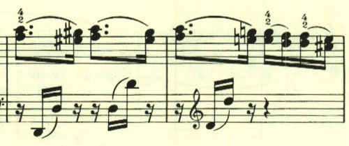

# ベートーヴェン ピアノ・ソナタ第10番 第1楽章

<iframe height="175" width="100%" title="Media player" src="https://embed.music.apple.com/us/album/piano-sonata-no-10-in-g-major-op-14-no-2-i-allegro/1268209323?i=1268209511&amp;itscg=30200&amp;itsct=music_box_player&amp;ls=1&amp;app=music&amp;mttnsubad=1268209511&amp;theme=auto" id="embedPlayer" style="border:0;border-radius:12px;width:100%;height:175px;max-width:660px" sandbox="allow-forms allow-popups allow-same-origin allow-scripts allow-top-navigation-by-user-activation" allow="autoplay *; encrypted-media *; clipboard-write"></iframe>

この曲も、様々なテーマが次々と登場する。

どのテーマも、ほのぼのとした暖かいもの。

1つ1つは違うテーマなのだが、雰囲気が非常に似ている。

展開部は、最初のテーマが短調で現れる。

様々なテーマが現れるこれまでの初期の作品とは異なり、展開部は基本的に提示部のテーマがきちんと展開される。

再現部は、一通り提示部の内容が繰り返された後、最初のテーマが再度現れて靜かに終わる。

楽譜引用はヘンレ版から。
