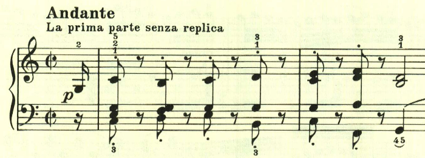
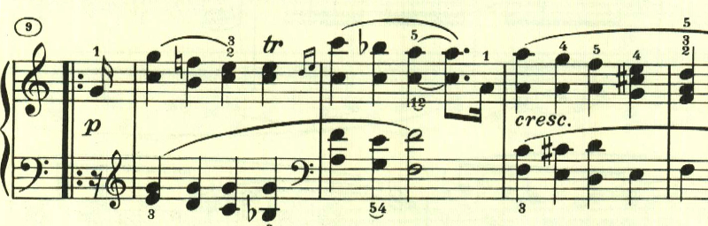
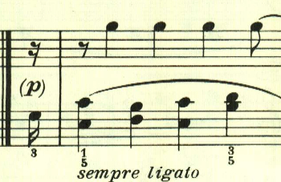
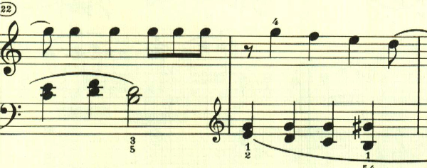
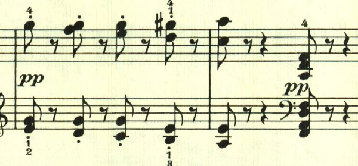

# ベートーヴェン ピアノソナタ 第10番 第2楽章

<iframe height="175" width="100%" title="Media player" src="https://embed.music.apple.com/us/album/piano-sonata-no-10-in-g-major-op-14-no-2-ii-andante/1268209323?i=1268209512&amp;itscg=30200&amp;itsct=music_box_player&amp;ls=1&amp;app=music&amp;mttnsubad=1268209512&amp;theme=auto" id="embedPlayer" style="border:0;border-radius:12px;width:100%;height:175px;max-width:660px" sandbox="allow-forms allow-popups allow-same-origin allow-scripts allow-top-navigation-by-user-activation" allow="autoplay *; encrypted-media *; clipboard-write"></iframe>

なんとも、かわいらしい行進曲のような変奏曲。

最初のテーマと、次のこのテーマが変奏される。

ここから変奏。

最後は、最初のテーマがそのまま繰り返されて、少しおどけた感じで終わる。

楽譜引用はヘンレ版。
