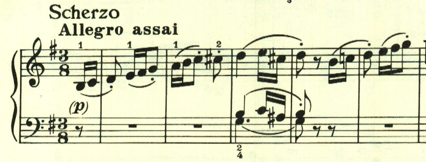
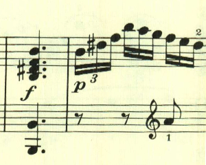
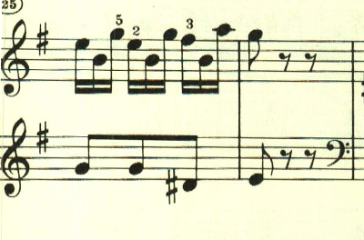
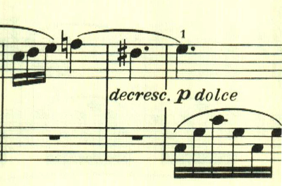
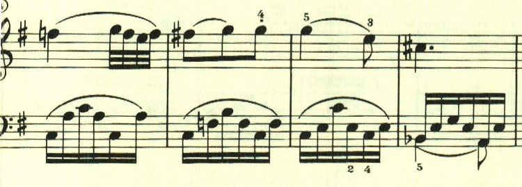
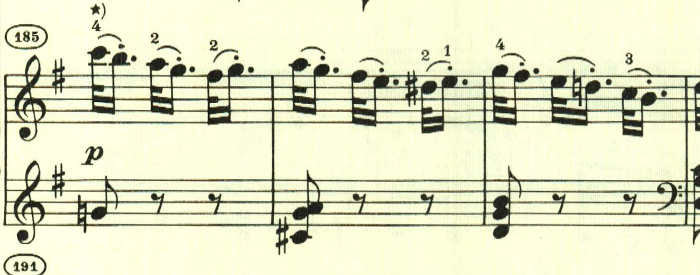
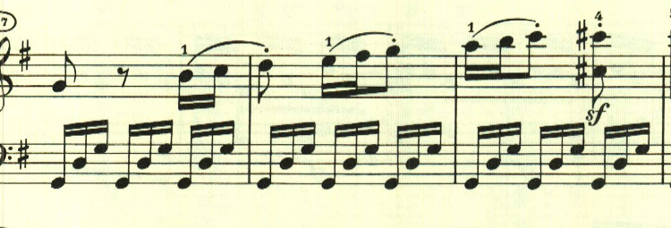

# ベートーヴェン ピアノソナタ第10番 第3楽章

<iframe height="175" width="100%" title="Media player" src="https://embed.music.apple.com/us/album/piano-sonata-no-10-in-g-major-op-14-no-2-iii-scherzo/1268209323?i=1268209513&amp;itscg=30200&amp;itsct=music_box_player&amp;ls=1&amp;app=music&amp;mttnsubad=1268209513&amp;theme=auto" id="embedPlayer" style="border:0;border-radius:12px;width:100%;height:175px;max-width:660px" sandbox="allow-forms allow-popups allow-same-origin allow-scripts allow-top-navigation-by-user-activation" allow="autoplay *; encrypted-media *; clipboard-write"></iframe>

珍しくスケルツォが最終楽章に配置されている。新たな試みへの挑戦なのかもしれない。テーマはどれも即興的で素朴なものが活用されている。

最初のテーマはスケール主体で、次のテーマはアルペジオ主体。

　

民謡風なテーマが現れる。

　

ここもスケール主体の素朴なもの。

最後は、最初のテーマが再度現れて終わる。

楽譜引用はヘンレ版
