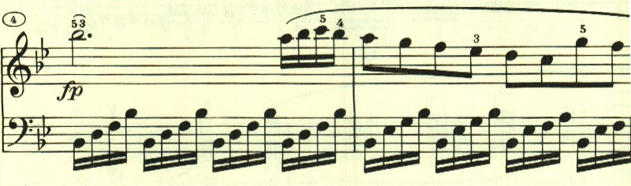

# ベートーヴェン ピアノソナタ第11番 第1楽章

<iframe height="175" width="100%" title="Media player" src="https://embed.music.apple.com/us/album/piano-sonata-no-11-in-b-flat-major-op-22-i-allegro-con-brio/1268209323?i=1268209514&amp;itscg=30200&amp;itsct=music_box_player&amp;ls=1&amp;app=music&amp;mttnsubad=1268209514&amp;theme=auto" id="embedPlayer" style="border:0;border-radius:12px;width:100%;height:175px;max-width:660px" sandbox="allow-forms allow-popups allow-same-origin allow-scripts allow-top-navigation-by-user-activation" allow="autoplay *; encrypted-media *; clipboard-write"></iframe>

第11番は、元気の良い主題で始まる。

この曲も様々なテーマが次々と登場し、初期ソナタの代表作と言える。

どのテーマも明るい光に溢れている。

ここで少し落ち着く。

スケール主体の力いっぱいのテーマ。

展開部は最初のテーマで始まる。

展開部では、このテーマが繰り返し用いられる。

最初のテーマが再現されて終わる。

